# 詳細設計書: <エージェント名> v1

> 本書は `spec.md` (要件) と `design.md` (アーキ概要) の **下位ドキュメント**。
> 実装者・レビュアー・運用者が読むことを想定し、図解を Mermaid で網羅する。
> このテンプレを `workspace/<project>/v1/detailed_design.md` にコピーして埋める。

---

## 0. 参照ドキュメント

| 略号 | ドキュメント | 役割 |
|---|---|---|
| **REQ** | `spec.md` | 業務要件・評価指標・運用条件 |
| **ARC** | `design.md` | アーキ概要・設計パターン採否・ノード分割 |
| **API** | `tools.md` | 関数仕様 (docstring + 落とし穴) |
| **CODE** | `scripts/` | 実装 |
| **本書** | `detailed_design.md` | 詳細設計 (図表中心) |

---

## 1. システムコンテキスト図

組織の技術ランドスケープでどこに位置するか。

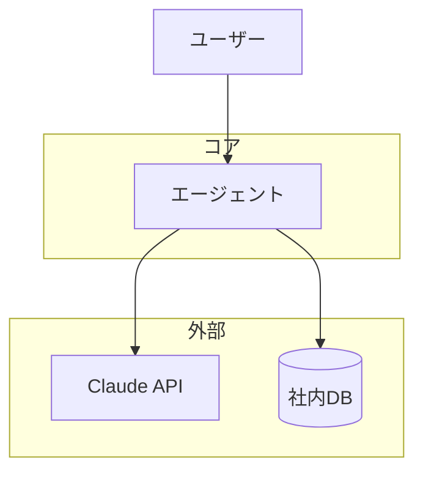

---

## 2. デプロイ図 (推奨配置)

本番でどこに何を配置するか。

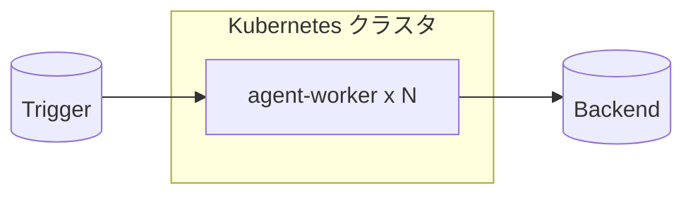

---

## 3. コンポーネント図 (パッケージ依存)

`scripts/` 配下のモジュール依存関係。

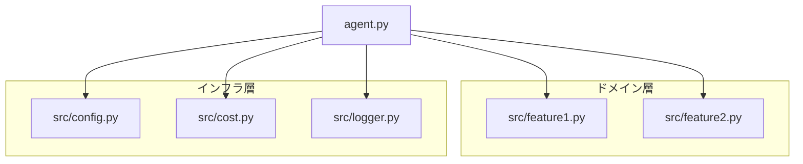

**依存方向の規則**: ドメイン層 → インフラ層 のみ。逆方向は禁止。

---

## 4. データモデル

### 4-1. State (TypedDict、実行時メモリ上)

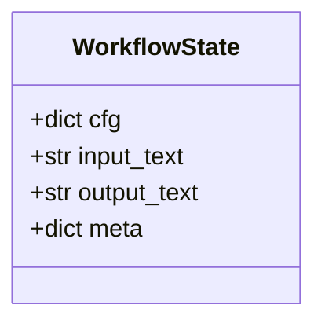

### 4-2. 永続データのスキーマ (該当する場合)

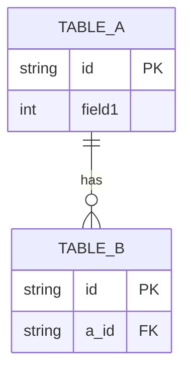

### 4-3. 出力 JSON スキーマ (配信先がある場合)

```json
{
  "field1": "string",
  "field2": "int",
  "meta": { ... }
}
```

---

## 5. シーケンス図 (主要ユースケース 5〜7 本)

### 5-1. 正常系

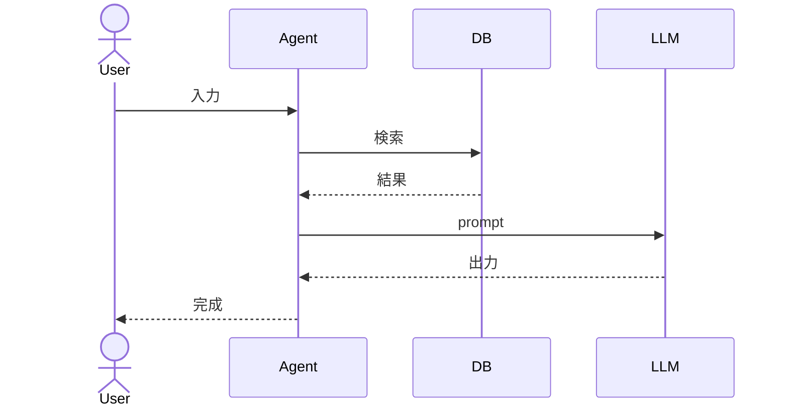

### 5-2. (バリエーション例)

(プロジェクト固有のバリエーション、3〜5 本)

### 5-3. 失敗系: 外部 API ダウン

(フォールバックの動作)

### 5-4. 失敗系: 致命検知 (PII / 危険データ)

---

## 6. 状態遷移図

### 6-1. ライフサイクル (運用視点)

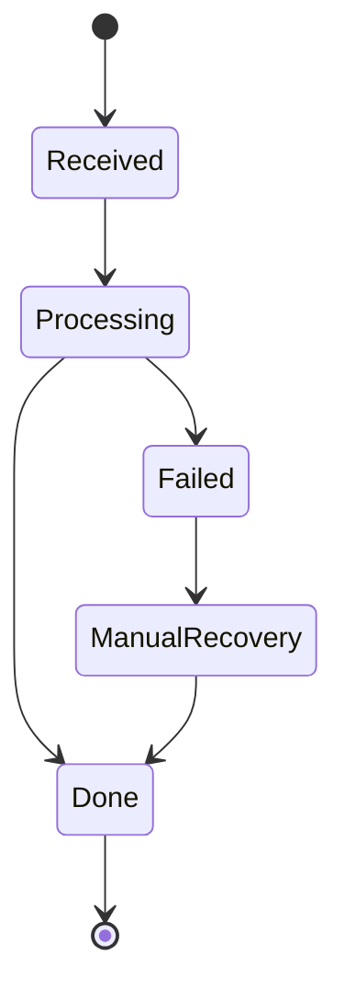

### 6-2. State の有効フィールド遷移 (実装視点)

各ノードを通過すると state にフィールドが追加される。**未通過ノードのフィールドは undefined**。

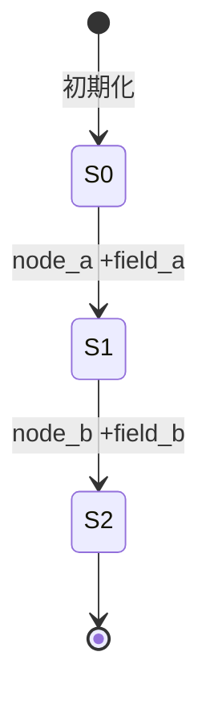

---

## 7. アクティビティ図 (主要分岐)

### 7-1. 判定分岐ノードの内部フロー

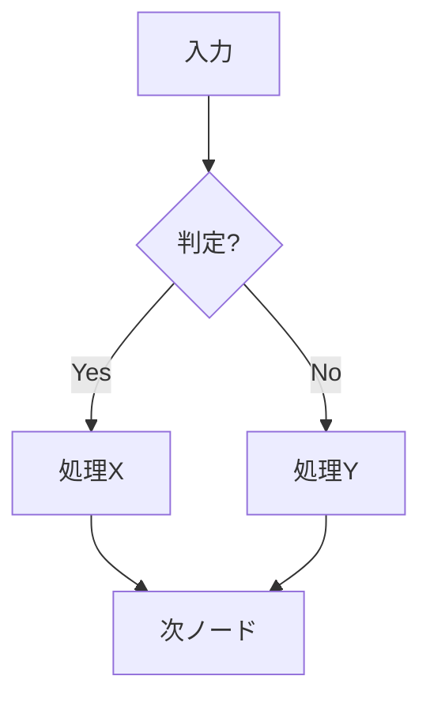

---

## 8. インターフェース仕様 (公開関数一覧)

### 8-1. src/feature1.py

| 関数 | シグネチャ | 副作用 | 例外 |
|---|---|---|---|
| `func_a` | `(x: int) -> str` | なし | なし |

### 8-2. src/feature2.py

| 関数 | シグネチャ | キャッシュ |
|---|---|---|
| `lookup` | `(key: str) -> Optional[dict]` | lru_cache(1024) |

---

## 9. エラー処理・例外フロー

### 9-1. ノード別の失敗ハンドリング

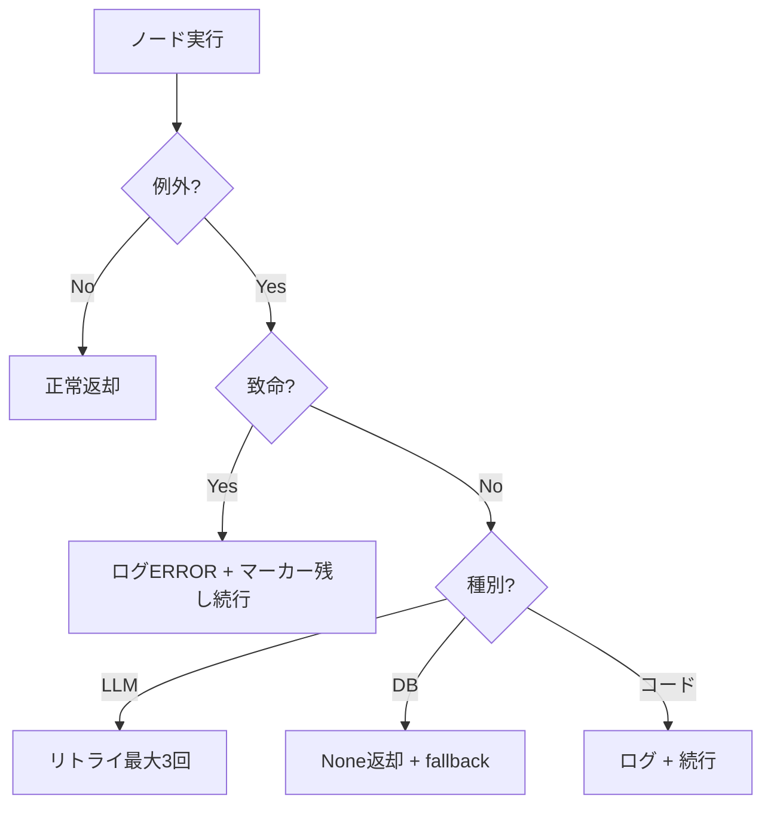

### 9-2. リトライ戦略

| 操作 | 最大回数 | バックオフ | フォールバック |
|---|---|---|---|
| LLM API | 3 | 指数 2,4,8s | テンプレ応答 |
| DB | 1 (即 fallback) | - | None |

### 9-3. 致命エラーの定義

(処理を続行するが運用通知が必須なもの)

| 種別 | 検知方法 | 通知先 | 復旧 |
|---|---|---|---|
| | | | |

---

## 10. ロギング・監視

### 10-1. ログレベル運用

| レベル | 用途 | 例 |
|---|---|---|
| INFO | 各ノード開始/終了/件数 | `[1/N] node_name` |
| WARNING | フォールバック発火 | |
| ERROR | 単発エラー (続行) | |
| CRITICAL | 致命 (要人手) | |

### 10-2. メトリクス (Datadog 等)

| メトリクス | 単位 | 用途 |
|---|---|---|
| `agent.processed_count` | counter | スループット |
| `agent.latency_seconds` | histogram | P95 レイテンシ |
| `agent.cost_usd_per_request` | gauge | 1件コスト |

---

## 11. 性能・コスト試算

### 11-1. レイテンシ予算 (Gantt)

```mermaid
gantt
    title 1リクエスト処理時間 (P95)
    dateFormat X
    axisFormat %S秒
    section ノード
    intake (~50ms) :a1, 0, 50
    LLM処理 (~10s) :a2, 50, 10050
    出力 (~100ms) :a3, 10050, 10150
```

### 11-2. コスト試算 (1件あたり)

| ノード | モデル | 入力tokens | 出力tokens | 単価 | 期待コスト |
|---|---|---|---|---|---|
| | | | | | |
| **合計** | | | | | **$X.XXX/件** |

---

## 12. セキュリティ要件

### 12-1. データの流れ (PII / 機密情報)

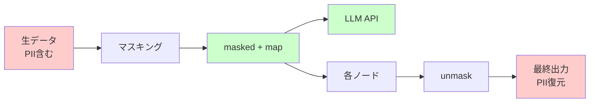

### 12-2. アクセス制御

| 項目 | アクセス可 | 認証 |
|---|---|---|
| | | |

### 12-3. 監査要件

| 要件 | 実装 |
|---|---|
| | |

---

## 13. テスト戦略

### 13-1. テストピラミッド

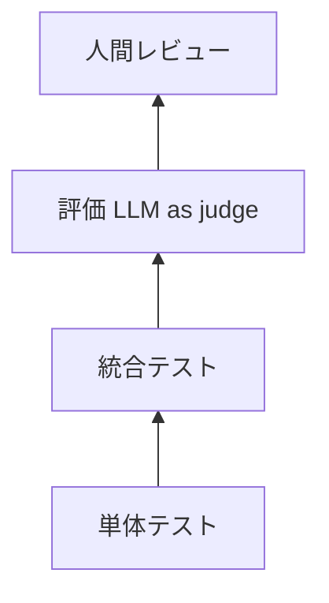

### 13-2. 単体テスト対象

| モジュール | テストケース例 | 件数目安 |
|---|---|---|
| | | |

### 13-3. 評価データセット拡充計画

(現在 N 件 → 目標 M 件のロードマップ)

### 13-4. 品質ゲート (prototype → eval → deploy)

| フェーズ | 通過基準 |
|---|---|
| prototype 完了 | コンパイル + dry-run 完走 |
| eval 完了 | 主要指標目標達成 |
| deploy 開始 | β テストで採用率 60%+ |
| 本番 | 1ヶ月シャドーで品質確認後 |

---

## 14. 改訂履歴

| バージョン | 日付 | 変更内容 |
|---|---|---|
| v1.0 | YYYY-MM-DD | 初版 |

---

## 付録A: ファイル構成チェックリスト

- [ ] `spec.md`
- [ ] `design.md`
- [ ] `tools.md`
- [ ] `detailed_design.md` (本書)
- [ ] `hearing_notes.md` (該当する場合)
- [ ] `usecase_catalog.md`
- [ ] `scripts/agent.py` + `src/*.py`
- [ ] `scripts/config/*.yaml`
- [ ] `scripts/eval/dataset/`
- [ ] `reports/{discover,decompose,prototype,eval}_report.md`

---

## 付録B: 用語集

| 用語 | 説明 |
|---|---|
| | |

---

## 詳細設計書を書くコツ (実プロジェクト経験から)

1. **シーケンス図は最低 5 本**: 正常系 / 主要バリエーション 2-3 / 失敗系 2-3
2. **状態遷移は 2 つ視点で**: 運用視点 (チケットライフサイクル) と 実装視点 (state フィールド遷移)
3. **エラー処理は flowchart で書く**: 「致命 vs 続行」の分岐が明確になる
4. **データの流れは色付きで**: PII 含む箇所 (赤) と マスク済み (緑) を視覚的に区別
5. **Gantt でレイテンシ予算**: 各ノードの所要時間を数値で書くと、後で実測との乖離が見える
6. **付録のチェックリストを使う**: ファイル構成漏れの防止

→ 実例: `workspace/cs_triage_agent/v1/detailed_design.md` (シーケンス7本 / 状態遷移3本 / 約1100行)
