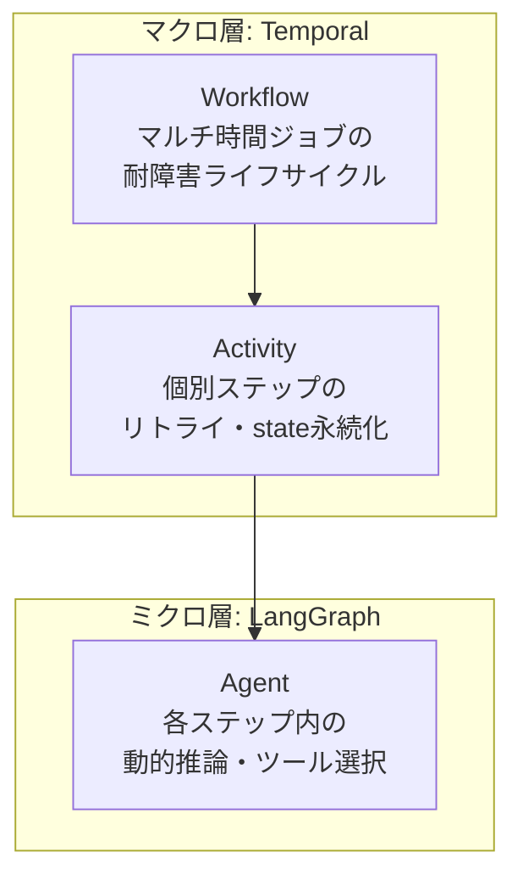
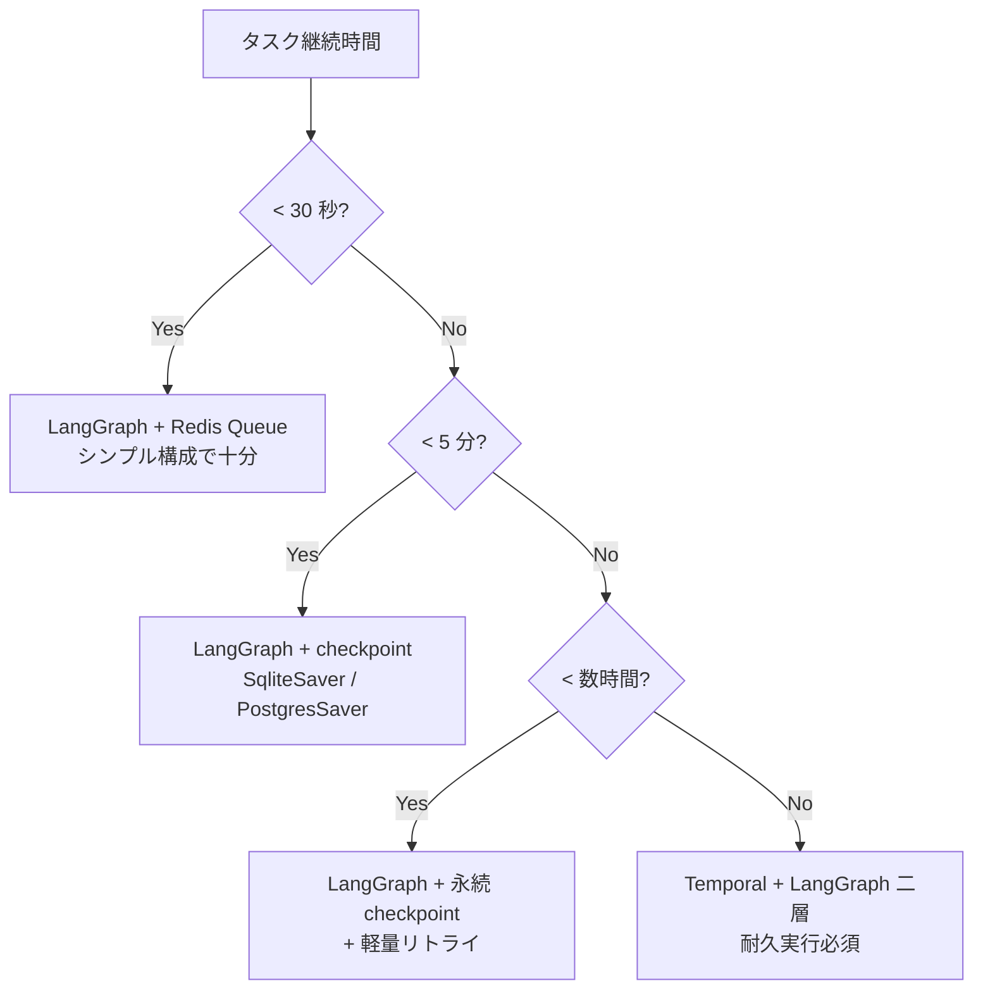

# Long-running エージェント設計パターン (2026 年標準)

> 30 秒で完了する短時間タスクなら本書は不要 (LangGraph + Redis Queue で十分)。
> **数分〜数時間続くタスク**を扱うとき、耐障害設計が必須になる。

---

## なぜ必要か

業界トレンド (2026):
- AI タスク継続時間が **7 ヶ月ごとに倍増**
- 2026 年現在: 2 時間自律タスクが標準
- 2026 年末: 8 時間労働日相当
- 2028 年: 40 時間/週、2029 年: 167 時間/月

→ **インフラ障害・LLM API ダウンが「途中で起きる」** ことが前提。
→ 耐久実行 (durable execution) が first-class 要件に。

---

## 二層アーキテクチャ (主流パターン)



| 層 | フレームワーク | 担当 |
|---|---|---|
| Macro (オーケストレーション) | **Temporal** | クラッシュ耐性・リトライ・state 永続化 |
| Micro (推論) | **LangGraph** | 動的な制御フロー、checkpoint、ツール呼び出し |

### Temporal の核となる保証
- ワークフローが任意のインフラ障害でクラッシュしても **「実行途中の activity から再開」** する
- ワーカープロセスが死んでも、別ワーカーが exact state から続きを実行
- Activity は冪等性を保つ前提で書く

### LangGraph の checkpoint 機能
- `MemorySaver` / `SqliteSaver` / `PostgresSaver` で state を永続化
- Temporal の activity 内で LangGraph を呼ぶときに、state を Temporal の event log に保存

---

## 採用判定: 短時間 vs 長時間



### 短時間タスク (cs_triage_agent v1 の例)
- 11 秒で完了 → 二層は過剰
- LangGraph の StateGraph + Redis Queue + リトライ手書きで十分
- Temporal を入れるとインフラ複雑度が +50%

### 長時間タスク (例: 8 時間の調査エージェント)
- LLM API ダウン・worker クラッシュが必ず起きる前提
- 各 LLM 呼び出しを Temporal Activity でラップ
- LangGraph の state を checkpoint に永続化
- 進捗を UI に逐次表示 (Server-Sent Events 等)

---

## 関連フレームワーク

### Temporal
- 耐久実行エンジン、複数言語 SDK (Python, Go, TS, Java)
- 2026/03 から OpenAI Agents SDK との Python 統合が GA
- ワーカーは horizontal scale 可、cluster は単一の真実源
- 落とし穴: Activity の冪等性設計、retry policy のチューニング

### Modal
- GPU 集約ワークロード (model 推論等) との組み合わせで主流
- Temporal で workflow / Modal で compute、という分業

### LangGraph (チェックポイント機能)
- v1.0.5 以降、永続 checkpoint がデフォルト機能化
- `from langgraph.checkpoint.postgres import PostgresSaver`
- thread_id で別セッションを管理

### Pydantic AI
- type-safe な agent 構築 + 耐久実行 first-class
- Temporal 統合あり

---

## 実装パターン (擬似コード)

```python
# Temporal Activity 内で LangGraph を呼ぶ
from temporalio import activity, workflow
from langgraph.checkpoint.postgres import PostgresSaver

@activity.defn
async def run_langgraph_step(state_thread_id: str, input_data: dict) -> dict:
    """1 つの推論ステップを Activity として実行。失敗時は Temporal がリトライ。"""
    checkpointer = PostgresSaver(conn_string=...)
    graph = build_my_langgraph().compile(checkpointer=checkpointer)
    config = {"configurable": {"thread_id": state_thread_id}}
    result = await graph.ainvoke(input_data, config=config)
    return result

@workflow.defn
class LongRunningResearchWorkflow:
    @workflow.run
    async def run(self, query: str) -> dict:
        thread_id = workflow.info().workflow_id  # Temporal が一意に管理
        # Step 1: 計画
        plan = await workflow.execute_activity(
            run_langgraph_step,
            args=[thread_id, {"step": "plan", "query": query}],
            start_to_close_timeout=timedelta(minutes=10),
            retry_policy=RetryPolicy(maximum_attempts=3),
        )
        # Step 2-N: 実行 (8 時間続くかも)
        for subtask in plan["subtasks"]:
            result = await workflow.execute_activity(
                run_langgraph_step,
                args=[thread_id, {"step": "execute", "subtask": subtask}],
                start_to_close_timeout=timedelta(hours=2),
            )
        # 統合
        return await workflow.execute_activity(
            run_langgraph_step,
            args=[thread_id, {"step": "synthesize"}],
            start_to_close_timeout=timedelta(minutes=15),
        )
```

→ 8 時間途中で worker が死んでも、再起動した別 worker が `thread_id` から state を復元して続行する。

---

## 移行判断: 短時間タスクから長時間タスクへ

既存の短時間構成 (LangGraph + Redis Queue) から長時間構成 (Temporal 二層) への移行コスト:

| 項目 | 工数 |
|---|---|
| Temporal Cluster セットアップ | 3〜5 日 (慣れ) |
| LangGraph state を Activity 化 | ノード数 × 2h |
| 既存 Redis Queue を Temporal に置換 | 1〜2 日 |
| 監視・アラートを Temporal UI 連携 | 2〜3 日 |
| **合計目安** | **2〜3 週間** |

→ 短時間タスクで動いているうちは Temporal を入れない。長時間タスクが必要になった時点で移行。

---

## さらに学ぶ

- [Temporal 公式](https://temporal.io/)
- [LangGraph checkpoint](https://langchain-ai.github.io/langgraph/concepts/persistence/)
- [LangGraph vs Temporal 比較記事 (2026)](https://agentmarketcap.ai/blog/2026/04/08/langgraph-vs-temporal-long-running-agent-workflows-2026)
- [Durable Agent Execution in Production 2026](https://agentmarketcap.ai/blog/2026/04/10/durable-agent-execution-production-temporal-modal-event-sourced)
