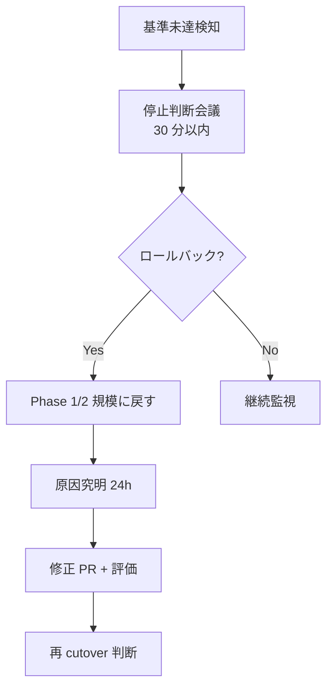

# 段階的ロールアウト計画テンプレート

> AI エージェントを本番運用に乗せる際の段階的ロールアウト計画。
> このテンプレを `workspace/<project>/v1/reports/deploy_design.md` の一部にコピーして埋める。

---

## ロールアウトの 4 フェーズ

```mermaid
gantt
    title <エージェント名> ロールアウト計画
    dateFormat YYYY-MM-DD
    section Phase 0 (準備)
    インフラ構築            :a1, YYYY-MM-DD, 7d
    連携設定               :a2, YYYY-MM-DD, 7d
    監視ダッシュボード作成   :a3, YYYY-MM-DD, 5d
    section Phase 1 (シャドー)
    シャドーモード稼働       :b1, YYYY-MM-DD, 30d
    週次レビュー            :b2, YYYY-MM-DD, 23d
    卒業基準達成            :milestone, YYYY-MM-DD, 0d
    section Phase 2 (パイロット)
    パイロット5名運用        :c1, YYYY-MM-DD, 14d
    オペアンケート          :c2, YYYY-MM-DD, 8d
    卒業基準達成            :milestone, YYYY-MM-DD, 0d
    section Phase 3 (全展開)
    Day1 +N名               :d1, YYYY-MM-DD, 1d
    Day3 +M名               :d2, YYYY-MM-DD, 1d
    Day5 +K名               :d3, YYYY-MM-DD, 1d
    全カテゴリ解禁          :milestone, YYYY-MM-DD, 0d
    本番安定運用            :d4, YYYY-MM-DD, 30d
```

---

## Phase 0: 準備 (1 週間)

### やること
- [ ] K8s namespace / インフラセットアップ
- [ ] 外部システム (Salesforce / Slack 等) との連携設定
- [ ] シークレット投入 (Vault → K8s Secret)
- [ ] Datadog ダッシュボード + Monitor 設定
- [ ] 障害ランブック準備 (`reference/runbook_template.md`)
- [ ] オペレーター教育 (30 分セッション × N回)

### 卒業基準
- [ ] 全コンポーネントのヘルスチェック OK
- [ ] エンドツーエンドのスモークテスト 1 件通過

---

## Phase 1: シャドーモード (1 ヶ月)

### 概要
- agent が動いて出力を生成するが、**送信機能は無効**
- 人間 (オペ) が AI ドラフトを参照できるが、実際は自分で本文を書いて送る
- 「使えそう度」を月次でアンケート

### やること
- [ ] `cfg.runtime.shadow_mode = true` で稼働
- [ ] 全件のドラフト + メタを CRM に保存
- [ ] 月次レビュー (品質 / コスト / 採用率)
- [ ] 失敗ケースを `eval/dataset/` に昇格

### 卒業基準 (プロジェクト固有に調整)

| 基準 | 標準閾値 |
|---|---|
| 主要指標 (プロジェクト依存) | spec.md §9 の目標達成 |
| クリティカルエラー | 0 件 (絶対条件) |
| オペアンケート「使えそう度」 | 平均 3.5/5 以上 |
| LLM Judge スコア | 3.5/5 以上 |
| インフラ可用性 | 99%+ |

→ **1 つでも未達なら Phase 1 延長**。延長は 2 週間単位。

---

## Phase 2: パイロット (2 週間)

### スコープ
- 期間: 2 週間
- メンバー: 5〜10 名 (ベテラン 2 + 中堅 2 + 新人 1)
- 対象: 主要カテゴリのみ (高リスクカテゴリは除外)
- 件数: 各メンバー 1 日 5〜10 件

### やること
- [ ] AIドラフト送信機能を有効化 (Phase 1 より一歩進める)
- [ ] 「採用 / 編集 / 棄却」フラグを CRM に記録
- [ ] 週次でパイロットメンバーから定性フィードバック取得
- [ ] ロールバック判断会議 (週 1)

### 卒業基準

| 基準 | 標準閾値 |
|---|---|
| オペ採用率 (そのまま + 軽微修正) | 70%+ |
| 平均応対時間 | プロジェクト目標達成 |
| 誤回答による再問い合わせ | 0 件 |
| オペ満足度 | 4.0/5 以上 |
| 本番ログから抽出した LLM Judge スコア | 3.5/5+ |

---

## Phase 3: 全展開 (1 週間で段階的)

### ロールアウトスケジュール

| Day | 追加メンバー | 累計 |
|---|---|---|
| Day 1 | +10 名 | 15 名 |
| Day 3 | +15 名 | 30 名 |
| Day 5 | +30 名 | 60 名 |
| Day 7 | 全カテゴリ解禁 (Phase 1-2 で除外していた高リスクカテゴリ含む) | - |

### やること (各 Day)
- [ ] 新メンバーへの 30 分オリエン
- [ ] 朝会で前日の問題確認
- [ ] Datadog ダッシュボードを 30 分毎チェック (運用初日のみ)
- [ ] ロールバック判断 (基準未達なら即停止)

### ロールバック条件 (どれか 1 つで停止)
- オペ採用率 70% 未達
- 誤回答による再問い合わせ件数 > 5 件/日
- LLM API エラー率 > 5%
- コスト 1 日あたり想定の 1.5 倍超過
- クリティカルエラー 1 件発生

→ 停止判断は SE / センター長 / SRE で 30 分以内に判断、ロールバック実行は 1 時間以内。

---

## ロールバック手順 (汎用)



---

## 全フェーズ共通: 監視・通知

各 Phase で監視しておくべき指標 (`reference/runbook_template.md` も参照):

| 指標 | 目標 | アラート閾値 |
|---|---|---|
| 1 件処理時間 P95 | プロジェクト目標 | 1.5 倍超過 |
| 1 件コスト | プロジェクト目標 | 2 倍超過 |
| エラー率 | < 2% | > 5% |
| 月予算消化率 | プロジェクト依存 | 80% / 95% |
| クリティカル発生率 | 0 | 1 件で即通知 |

---

## 教育・ドキュメント

| 対象 | 内容 | 配布物 |
|---|---|---|
| オペレーター | 業務手順書、AIドラフトの読み方、棄却理由の記入 | `scripts/operator_workflow.md` |
| スーパーバイザー | クレーム alert 対応、SV 併走フロー | 同上 + 別途研修 |
| SE / SRE | ランブック、シークレット管理、障害対応 | `runbook_template.md` |
| センター長 | 月次品質レポートの読み方、改善判断 | 月次レビュー資料 |

---

## 実例

完全な実装例: `workspace/cs_triage_agent/v1/reports/deploy_design.md` §3〜13、`scripts/operator_workflow.md`
