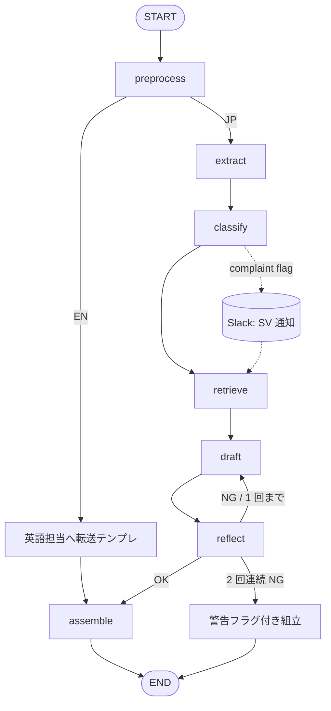

# 設計図: CS Triage Agent v1

> 入力: `v1/spec.md`
> 作成日: 2026-05-08
> 作成者: agent-decompose

---

## 1. グラフ構造

LangGraph `StateGraph` でハイブリッドなワークフロー型を構築。基本パスは決定論的順序、Reflection ノードのみ条件付きの 1 回ループ。



> 主要パス: `preprocess → extract → classify → retrieve → draft → reflect → assemble`（最大 7 ステップ）。
> Reflection の再起動は **1 回まで**（コスト爆発防止）。2 回連続 NG なら警告フラグを付けて出す（オペが手動で精査）。

---

## 2. ノード一覧

| # | ノード | 責務 | LLM/コード | 入力 | 出力 |
|---|---|---|---|---|---|
| 1 | `preprocess` | PII マスキング、言語判定、添付検出、引用履歴の切り詰め | コード | 生メール本文 | masked_text, lang, has_attachment |
| 2 | `extract` | 型番・注文番号の抽出（regex 主・LLM 補完任意） | ハイブリッド（Haiku 4.5 補完） | masked_text | skus[], order_nos[], extract_confidence |
| 3 | `classify` | カテゴリ判定 + 緊急度 + クレーム匂い検出（キーワード辞書 + LLM 二重判定）| コード前処理 + LLM（Sonnet 4.6） | masked_text, skus, order_nos | category, urgency, complaint_smell, confidence |
| 4 | `retrieve` | DB 引き当て（在庫・価格・出荷・廃番・CAD）。Tool Use ノード | コード（並列 Tool 呼び出し） | skus, order_nos, category | retrieved_data（辞書）, retrieve_errors |
| 5 | `draft` | 顧客向け本文 + 内部メモのドラフト生成 | LLM（Sonnet 4.6 / 軽量モードは Haiku 4.5） | category, masked_text, retrieved_data | draft_body, internal_memo, missing_info |
| 6 | `reflect` | 自己レビュー（数字捏造チェック / 必須テンプレ語含有 / クレーム時の引き継ぎ確認 / トーン） | LLM（Sonnet 4.6） | draft_body, retrieved_data, complaint_smell | reflect_pass, reflect_issues |
| 7 | `assemble` | メタ JSON + 本文 + 内部メモを統合し、PII を unmask して最終出力 | コード | 全 state | final_output（JSON）|

ノード数: **7**（spec の規約「5〜7 が目安」に収まる）。

---

## 3. 設計パターン選定

### 採用

| パターン | 適用箇所 | 理由 |
|---|---|---|
| **Tool Use** | `retrieve` ノード | 在庫・価格・出荷・廃番・CAD を社内 DB / API から取得する必要があり、LLM 単体では不可能。最小権限ツールを 5 種に分離 |
| **Reflection** | `reflect` ノード（最大 1 回ループ） | 「DB 引き当てた値を LLM が改変していないか」「必須テンプレ語が抜けていないか」「クレーム時の引き継ぎ文言があるか」を検査。再現率優先（致命リスクなので） |

### 不採用

| パターン | 理由 |
|---|---|
| **Planning** | 業務ステップは「分類 → 抽出 → 引き当て → 起草」で固定。動的計画の価値なし。むしろ予測可能性が下がりデバッグ困難に |
| **Multi-Agent** | v1 では役割分担の利益がコストを上回らない。draft+reflect 程度なら同一エージェント内で十分。v2 以降で「Planner+Reviewer+Synthesizer」化を検討（spec.md §13 参照）|

→ v1 は **「ワークフロー型 + Tool Use（retrieve）+ Reflection（reflect）」のハイブリッド** で確定。

---

## 4. データフロー

### 4-1. State (TypedDict)

```python
from typing import TypedDict, Literal, Optional

class TriageState(TypedDict, total=False):
    # 入力（preprocess 前）
    raw_text: str
    case_id: str

    # preprocess の出力
    masked_text: str
    pii_map: dict[str, str]      # placeholder → original の復元用
    lang: Literal["ja", "en", "other"]
    has_attachment: bool

    # extract の出力
    skus: list[str]
    order_nos: list[str]
    extract_confidence: float

    # classify の出力
    category: Literal["inventory", "tech", "alternative", "shipment",
                      "cad", "billing", "complaint", "other"]
    urgency: Literal["low", "normal", "high"]
    complaint_smell: bool
    classify_confidence: float

    # retrieve の出力
    retrieved_data: dict          # {"inventory": {...}, "price": {...}, ...}
    retrieve_errors: list[str]    # DB 引き当て失敗のリスト

    # draft の出力
    draft_body: str
    internal_memo: str
    missing_info: list[str]       # 顧客に逆質問すべき項目

    # reflect の出力
    reflect_pass: bool
    reflect_issues: list[str]
    reflect_iter: int             # ループ回数

    # assemble の出力
    final_output: dict            # 最終 JSON（顧客向け本文 + メタ + 内部メモ）

    # 共通
    cost_usd: float
    used_models: list[str]
```

> ⚠️ **TypedDict は宣言外フィールドを silent drop** する。新フィールドを追加するときは必ず TypedDict に追記する（`AGENT_MINDSET.md` 参照）。

### 4-2. PII マスキングの流れ

```
raw_text → preprocess (mask) → pii_map 保管 → 各ノード（masked_text のみ扱う）
                                                ↓
                                          assemble (unmask) → final_output（PII 復元）
```

- LLM API には **必ず masked_text のみ送信**。pii_map は state 内に保持し、最終 assemble でのみ復元
- ログには masked_text と pii_map のハッシュのみ残す（spec §10-3）

---

## 5. ツール一覧

詳細は `tools.md` を参照。`retrieve` ノード内で並列呼び出し。

| ツール名 | 機能 | 呼び出し条件 |
|---|---|---|
| `lookup_inventory(sku)` | 在庫数 + 出荷可能日 | category ∈ {inventory, alternative} |
| `lookup_price(sku, customer_id)` | 単価（取引先別） | category = inventory（金額質問あれば）|
| `lookup_shipment(order_no)` | 出荷状況 + 追跡番号 | category = shipment、order_nos 非空 |
| `lookup_discontinued(sku)` | 廃番フラグ + 後継品 | category ∈ {inventory, alternative} |
| `lookup_cad_url(sku)` | CAD / 図面 URL | category = cad |
| `mask_pii(text)` | PII マスキング（preprocess 内）| 全件 |

> **重要**: ツールは LLM が直接呼ぶのではなく、`retrieve` ノード内のコードがカテゴリに応じて呼び分ける（**疑似 Tool Use**）。これにより LLM の判断ミスでツール過剰呼び出しが起こらない。LangGraph 的には ReAct ではなく単なる関数ノード。

---

## 6. コスト見積もり

### 6-1. 標準モード（Sonnet 4.6 中心）

| ノード | モデル | 入力 tokens | 出力 tokens | 単価試算 | 期待コスト |
|---|---|---|---|---|---|
| preprocess | - | - | - | - | $0.000 |
| extract（補完）| Haiku 4.5 | 500 | 100 | $0.80/M, $4/M | $0.0008 |
| classify | Sonnet 4.6 | 800 | 150 | $3/M, $15/M | $0.0046 |
| retrieve | - | - | - | - | $0.000（DB のみ） |
| draft | Sonnet 4.6 | 1,500 | 500 | $3/M, $15/M | $0.0120 |
| reflect | Sonnet 4.6 | 2,000 | 200 | $3/M, $15/M | $0.0090 |
| assemble | - | - | - | - | $0.000 |
| **合計** | | **4,800** | **950** | | **約 $0.027/件** |

→ 目標 **$0.05/件** 以下 ✓ （余裕あり、Reflection 1 回ループまで含む）

### 6-2. 軽量モード（Haiku 4.5 のみ、簡易質問用）

| ノード | モデル | 期待コスト |
|---|---|---|
| classify | Haiku 4.5 | $0.0006 |
| draft | Haiku 4.5 | $0.0028 |
| reflect | Haiku 4.5 | $0.0016 |
| **合計** | | **約 $0.005/件** |

軽量モード起動条件（`classify` で判定）:
- カテゴリが `shipment`（注文番号 → DB 引き当て → URL 返答）
- カテゴリが `cad`（CAD URL 返答）
- カテゴリが `billing`（経理引き継ぎテンプレ）
- complaint_smell が False かつ extract_confidence > 0.9

→ 全件の **約 30〜40% を軽量モードで処理** できる想定。月間平均コストはさらに下がる。

### 6-3. 月間試算（月 6 万件想定）

| 内訳 | 件数 | 単価 | 月額 |
|---|---|---|---|
| 標準モード（60%）| 36,000 | $0.027 | $972 |
| 軽量モード（40%）| 24,000 | $0.005 | $120 |
| **合計** | 60,000 | - | **約 $1,092** |

→ 月予算 $3,000 に対し **36% 程度の消費**。Reflection 暴走や DB エラー時のリトライを考慮しても余裕あり。

---

## 7. 失敗モードと対処

| ノード | 失敗パターン | 対処 |
|---|---|---|
| preprocess | マスキング regex の漏れ | 監視: 月次でマスキング前後ログ照合（spec §10-3）|
| extract | 型番抽出ゼロ件 | 内部メモに「型番が抽出できませんでした。手動確認をお願いします」+ オペ通知 |
| classify | LLM API ダウン | キーワード辞書のみで暫定分類 + reflect_issues に記録 |
| retrieve | DB ダウン | 「在庫情報取得失敗。担当より折り返しご連絡」テンプレ + 内部通知 |
| retrieve | SKU が DB にない | 「在庫情報を確認中。お時間いただきます」テンプレ + 型番マスタ追加候補 |
| draft | LLM API タイムアウト | 3 回リトライ（指数バックオフ）→ 失敗時は「AI 生成失敗、手動対応してください」フラグ |
| reflect | 2 回連続 NG | 警告フラグ付きで assemble へ。オペが手動精査 |

---

## 8. 設定駆動範囲（YAML）

センター長 / SE が運用しながら調整できる範囲を `config/cs_triage.yaml` に集約:

```yaml
# config/cs_triage.yaml
categories:
  inventory:
    keywords: [在庫, 納期, いつ届く]
    confidence_threshold: 0.6
  complaint:
    keywords: [困って, 至急, 何度目, まだ, 結局, 前回も]
    confidence_threshold: 0.5

sku_patterns:
  - name: standard
    regex: '\b(?!(?:ORD|INV|REF)-)[A-Z]{2,5}-[A-Z]?M?\d{1,4}(?:-\d{1,4})?(?:-[A-Z]+\d*)?\b'
  # 他カテゴリ追加可

order_no_patterns:
  - regex: '\bORD-\d{4}-\d{5,6}\b'

complaint_keywords: [困って, 至急, 何度目, まだ, 結局, 前回も]

templates:
  greeting: "お世話になっております。"
  closing: "ご確認のほどよろしくお願いいたします。"
  apology_prefix: "この度はご不便をおかけし、誠に申し訳ございません。"
  english_transfer: "Thank you for your inquiry. We will transfer your request to our English support team."

models:
  classify: claude-sonnet-4-6
  draft: claude-sonnet-4-6
  draft_lite: claude-haiku-4-5-20251001
  extract_assist: claude-haiku-4-5-20251001
  reflect: claude-sonnet-4-6

cost:
  max_per_request_usd: 0.10
  max_monthly_usd: 3000

reflection:
  max_iterations: 1
```

---

## 9. 主要な設計判断（決めた / 捨てた）

### 決めた

1. **ワークフロー型 + Tool Use + Reflection** のハイブリッドで確定（純エージェントは不採用）
2. **マスキングは preprocess で 1 回**、以後は masked_text のみで処理
3. **Reflection は 1 回ループまで**（コスト爆発防止）
4. **軽量モード（Haiku のみ）を classify の判定で起動**、定型ケース 30〜40% を低コスト処理
5. **ツールは LLM が直呼びせず、retrieve ノード内のコードがカテゴリで分岐**（誤呼び出し防止）
6. **YAML 駆動範囲を明確化**: カテゴリキーワード、テンプレ文言、型番 regex、コスト上限

### 捨てた

| 選択肢 | 捨てた理由 |
|---|---|
| 純 ReAct（LLM が retrieve を自分で計画）| 業務が定型化されており、LLM の判断余地は害悪。誤呼び出しでコスト増 |
| Multi-Agent（Planner+Reviewer）| v1 では役割分担の利益がコスト・複雑性を上回らない。v2 以降で再検討 |
| Planning（タスク分解）| 「分類 → 引き当て → 起草」が固定なので不要 |
| RAG（FAQ 検索）| v1 ではユースケース 25（FAQ 自動応答）が C ランク。v2 以降の検討 |
| Reflection 多段ループ（3 回以上）| コスト爆発リスク + 改善が頭打ちになりやすい |
| ノード分割を 10 個以上に細分化 | 見通しが悪くなる。7 ノードで責務が明確に切れる |

---

## 10. 次のアクション

- [ ] `/agent-prototype` で `reference/workflow_skeleton.py` をベースに最小実装を組む
- [ ] DB は YAML / JSON フィクスチャでモック（`scripts/eval/mock_db/` に配置）
- [ ] 評価データ 20 件を `scripts/eval/dataset/` に合成データで作成
- [ ] `config/cs_triage.yaml` の初版を書く（本書 §8 のサンプルを起点に）
- [ ] PII マスキング regex を `src/pii_mask.py` に実装（氏名 / 電話 / 住所 / 会社名）

---

## 11. 既存リファレンス実装（cs_triage_agent v1）との差分

| 観点 | リファレンス v1（9 ノード） | 本 v3 v1（7 ノード） | 備考 |
|---|---|---|---|
| ノード数 | 9 | 7 | preprocess + assemble に統合し簡素化 |
| 軽量モード | あり（cs_triage_lite.yaml） | あり（YAML で起動条件を明示） | 起動判定ロジックを classify 結果から自動 |
| Reflection | あり | あり（1 回ループ）| 同等 |
| Tool Use | 関数ノードとして実装（疑似 Tool Use）| 同方針 | LLM の Tool 直呼びは不採用 |
| マスキング | preprocess 内 | preprocess 内 | 同等 |

→ 大筋はリファレンスと整合。本 v3 はノード分割を一段シンプルにし、Reflection の終了条件と軽量モード起動を YAML で明示する点が改善。

---

## 12. 詳細設計書

シーケンス図・状態遷移・データモデル・エラーフロー・PII の流れ等は `detailed_design.md` に網羅した。実装・レビュー・運用時はそちらを参照。
