# 詳細設計書: CS Triage Agent v1

> 本書は `spec.md` (要件) と `design.md` (アーキ概要) の **下位ドキュメント**。
> 実装者・レビュアー・運用者が読むことを想定し、図解を Mermaid で網羅。
>
> 作成日: 2026-05-08
> 作成者: agent-decompose

---

## 0. 参照ドキュメント

| 略号 | ドキュメント | 役割 |
|---|---|---|
| **REQ** | `spec.md` | 業務要件・評価指標・運用条件 |
| **ARC** | `design.md` | アーキ概要・設計パターン採否・ノード分割 |
| **API** | `tools.md` | 関数仕様（docstring + 落とし穴）|
| **CODE** | `scripts/`（prototype 後）| 実装 |
| **本書** | `detailed_design.md` | 詳細設計（図表中心）|

---

## 1. システムコンテキスト図

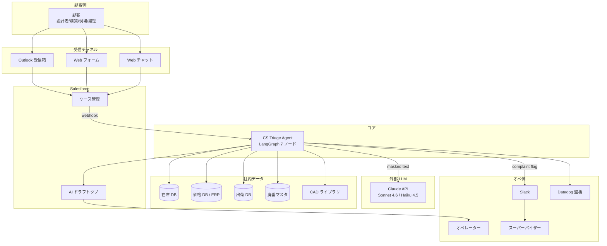
```mermaid
graph TB
    subgraph CUS[顧客側]
        Customer[顧客<br/>設計者/購買/現場/経理]
    end
    subgraph CHN[受信チャネル]
        Email[Outlook 受信箱]
        Web[Web フォーム]
        Chat[Web チャット]
    end
    subgraph CRM[Salesforce]
        SFCase[ケース管理]
        SFDraft[AI ドラフトタブ]
    end
    subgraph CORE[コア]
        Agent[CS Triage Agent<br/>LangGraph 7 ノード]
    end
    subgraph EXT[外部 LLM]
        Claude[Claude API<br/>Sonnet 4.6 / Haiku 4.5]
    end
    subgraph INTL[社内データ]
        InvDB[(在庫 DB)]
        PriceDB[(価格 DB / ERP)]
        ShipDB[(出荷 DB)]
        DiscMaster[(廃番マスタ)]
        CADLib[CAD ライブラリ]
    end
    subgraph OPS[オペ側]
        Operator[オペレーター]
        SV[スーパーバイザー]
        Slack[Slack]
        Datadog[Datadog 監視]
    end
    Customer --> Email & Web & Chat
    Email & Web & Chat --> SFCase
    SFCase -->|webhook| Agent
    Agent -->|masked text| Claude
    Agent --> InvDB & PriceDB & ShipDB & DiscMaster & CADLib
    Agent --> SFDraft
    Agent -->|complaint flag| Slack
    Slack --> SV
    SFDraft --> Operator
    Agent --> Datadog
```

---

## 2. デプロイ図（推奨配置）

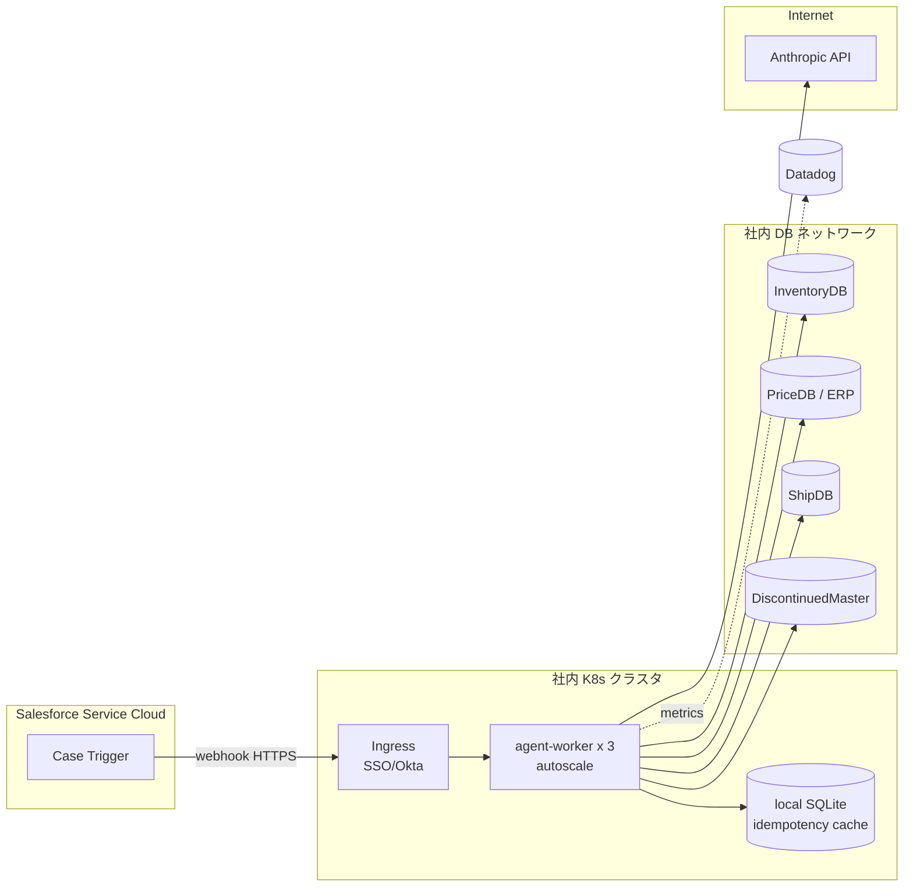
```mermaid
graph LR
    subgraph SF[Salesforce Service Cloud]
        Hook[Case Trigger]
    end
    subgraph K8s[社内 K8s クラスタ]
        IngressCtrl[Ingress<br/>SSO/Okta]
        Pod1[agent-worker x 3<br/>autoscale]
        SQLite[(local SQLite<br/>idempotency cache)]
        Pod1 --> SQLite
    end
    subgraph DB[社内 DB ネットワーク]
        IDB[(InventoryDB)]
        PDB[(PriceDB / ERP)]
        SDB[(ShipDB)]
        DMA[(DiscontinuedMaster)]
    end
    subgraph EXT[Internet]
        Anth[Anthropic API]
    end
    Hook -->|webhook HTTPS| IngressCtrl
    IngressCtrl --> Pod1
    Pod1 --> IDB & PDB & SDB & DMA
    Pod1 --> Anth
    Pod1 -.metrics.-> Datadog[(Datadog)]
```

**Pod 配置方針**:
- 1 Pod = 1 CPU / 1 GB RAM、初期 3 Pod。HPA で QPS = 5/sec 超過時にスケールアウト
- ステートフル要素は SQLite（ケース ID と AI ドラフトの紐付け、重複排除用）のみ。Pod 外には共有ストレージ不要

---

## 3. コンポーネント図（パッケージ依存）

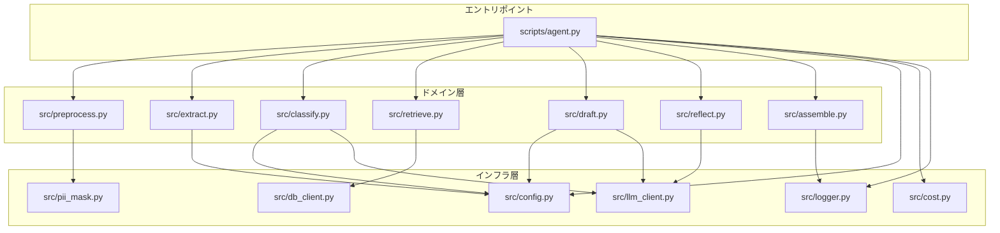
```mermaid
graph TD
    subgraph Entry[エントリポイント]
        AGENT[scripts/agent.py]
    end
    subgraph Domain[ドメイン層]
        D1[src/preprocess.py]
        D2[src/extract.py]
        D3[src/classify.py]
        D4[src/retrieve.py]
        D5[src/draft.py]
        D6[src/reflect.py]
        D7[src/assemble.py]
    end
    subgraph Infra[インフラ層]
        I1[src/config.py]
        I2[src/cost.py]
        I3[src/logger.py]
        I4[src/llm_client.py]
        I5[src/db_client.py]
        I6[src/pii_mask.py]
    end
    AGENT --> D1 & D2 & D3 & D4 & D5 & D6 & D7
    D1 --> I6
    D2 --> I1
    D3 --> I1 & I4
    D4 --> I5
    D5 --> I1 & I4
    D6 --> I4
    D7 --> I3
    AGENT --> I1 & I2 & I3
```

**依存方向の規則**: ドメイン層 → インフラ層 のみ。逆方向は禁止。

---

## 4. データモデル

### 4-1. State (TypedDict、実行時メモリ上)

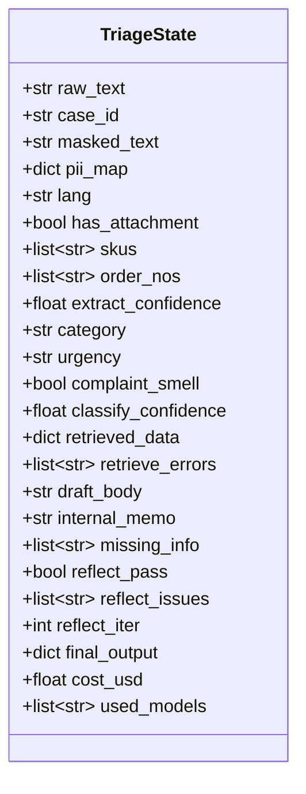
```mermaid
classDiagram
    class TriageState {
        +str raw_text
        +str case_id
        +str masked_text
        +dict pii_map
        +str lang
        +bool has_attachment
        +list~str~ skus
        +list~str~ order_nos
        +float extract_confidence
        +str category
        +str urgency
        +bool complaint_smell
        +float classify_confidence
        +dict retrieved_data
        +list~str~ retrieve_errors
        +str draft_body
        +str internal_memo
        +list~str~ missing_info
        +bool reflect_pass
        +list~str~ reflect_issues
        +int reflect_iter
        +dict final_output
        +float cost_usd
        +list~str~ used_models
    }
```

> ⚠️ TypedDict 全フィールド宣言を忘れない（silent drop 罠 / `AGENT_MINDSET.md` 参照）。

### 4-2. 永続データ（SQLite, idempotency cache）

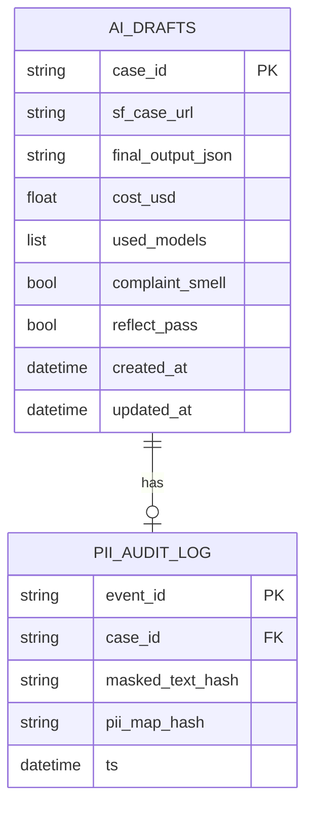
```mermaid
erDiagram
    AI_DRAFTS {
        string case_id PK
        string sf_case_url
        string final_output_json
        float cost_usd
        list used_models
        bool complaint_smell
        bool reflect_pass
        datetime created_at
        datetime updated_at
    }
    PII_AUDIT_LOG {
        string event_id PK
        string case_id FK
        string masked_text_hash
        string pii_map_hash
        datetime ts
    }
    AI_DRAFTS ||--o| PII_AUDIT_LOG : has
```

### 4-3. 出力 JSON スキーマ

`final_output`（`assemble` ノードの最終出力）:

```json
{
  "case_id": "5005A0000001234",
  "schema_version": "v1.0",
  "meta": {
    "category": "inventory",
    "urgency": "normal",
    "skus": ["SHA-M6-20-N", "SHA-M8-25-N"],
    "order_nos": [],
    "complaint_smell": false,
    "classify_confidence": 0.92,
    "extract_confidence": 0.97,
    "used_models": ["claude-sonnet-4-6"],
    "cost_usd": 0.0231,
    "lang": "ja",
    "has_attachment": false,
    "reflect_pass": true,
    "reflect_iter": 0
  },
  "customer_body": "お世話になっております。お問い合わせいただいた SHA-M6-20-N は ... ご確認のほどよろしくお願いいたします。",
  "internal_memo": "在庫 DB 引き当て成功。SHA-M8-25-N は廃番予定のため後継 SHA-M8-25-N2 を併記。",
  "flags": {
    "needs_supervisor": false,
    "ai_generation_failed": false,
    "pii_warning": false
  }
}
```

---

## 5. シーケンス図（主要ユースケース 6 本）

### 5-1. 正常系: 在庫照会（標準モード）

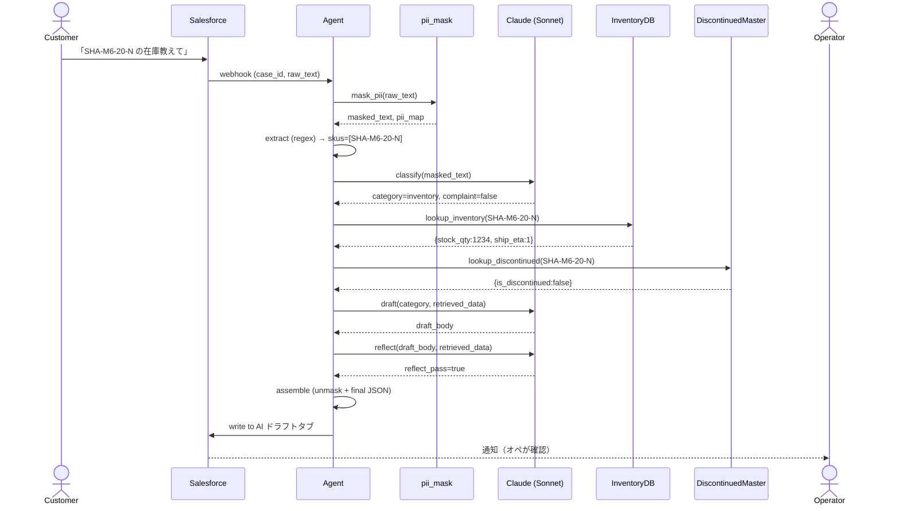
```mermaid
sequenceDiagram
    actor C as Customer
    participant SF as Salesforce
    participant A as Agent
    participant Mask as pii_mask
    participant LLM as Claude (Sonnet)
    participant Inv as InventoryDB
    participant Disc as DiscontinuedMaster
    actor O as Operator
    C->>SF: 「SHA-M6-20-N の在庫教えて」
    SF->>A: webhook (case_id, raw_text)
    A->>Mask: mask_pii(raw_text)
    Mask-->>A: masked_text, pii_map
    A->>A: extract (regex) → skus=[SHA-M6-20-N]
    A->>LLM: classify(masked_text)
    LLM-->>A: category=inventory, complaint=false
    A->>Inv: lookup_inventory(SHA-M6-20-N)
    Inv-->>A: {stock_qty:1234, ship_eta:1}
    A->>Disc: lookup_discontinued(SHA-M6-20-N)
    Disc-->>A: {is_discontinued:false}
    A->>LLM: draft(category, retrieved_data)
    LLM-->>A: draft_body
    A->>LLM: reflect(draft_body, retrieved_data)
    LLM-->>A: reflect_pass=true
    A->>A: assemble (unmask + final JSON)
    A->>SF: write to AI ドラフトタブ
    SF-->>O: 通知（オペが確認）
```

### 5-2. クレーム匂い検出 → SV 通知

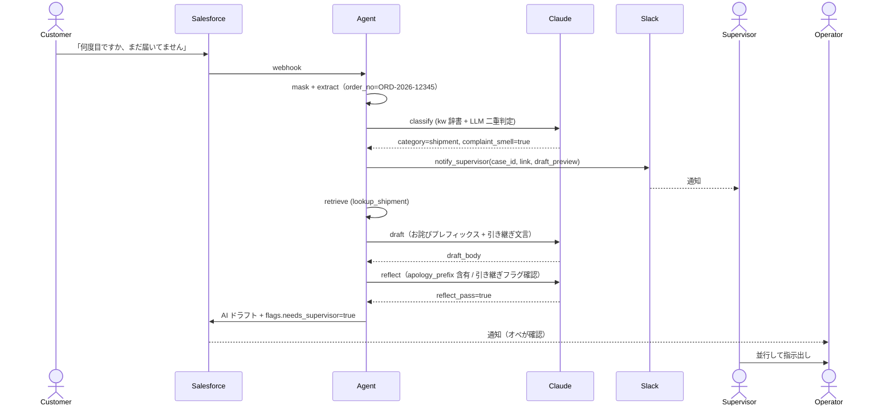
```mermaid
sequenceDiagram
    actor C as Customer
    participant SF as Salesforce
    participant A as Agent
    participant LLM as Claude
    participant Slack
    actor SV as Supervisor
    actor O as Operator
    C->>SF: 「何度目ですか、まだ届いてません」
    SF->>A: webhook
    A->>A: mask + extract（order_no=ORD-2026-12345）
    A->>LLM: classify (kw 辞書 + LLM 二重判定)
    LLM-->>A: category=shipment, complaint_smell=true
    A->>Slack: notify_supervisor(case_id, link, draft_preview)
    Slack-->>SV: 通知
    A->>A: retrieve (lookup_shipment)
    A->>LLM: draft（お詫びプレフィックス + 引き継ぎ文言）
    LLM-->>A: draft_body
    A->>LLM: reflect（apology_prefix 含有 / 引き継ぎフラグ確認）
    LLM-->>A: reflect_pass=true
    A->>SF: AI ドラフト + flags.needs_supervisor=true
    SF-->>O: 通知（オペが確認）
    SV->>O: 並行して指示出し
```

### 5-3. 廃番型番 → 後継品提示（先回り）

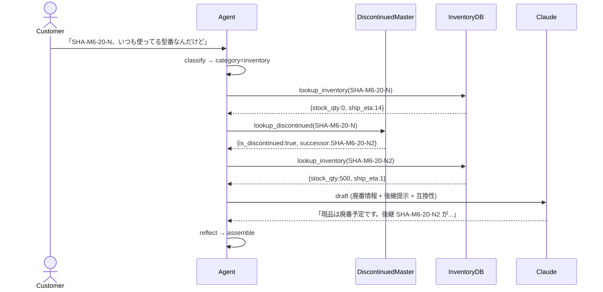
```mermaid
sequenceDiagram
    actor C as Customer
    participant A as Agent
    participant Disc as DiscontinuedMaster
    participant Inv as InventoryDB
    participant LLM as Claude
    C->>A: 「SHA-M6-20-N、いつも使ってる型番なんだけど」
    A->>A: classify → category=inventory
    A->>Inv: lookup_inventory(SHA-M6-20-N)
    Inv-->>A: {stock_qty:0, ship_eta:14}
    A->>Disc: lookup_discontinued(SHA-M6-20-N)
    Disc-->>A: {is_discontinued:true, successor:SHA-M6-20-N2}
    A->>Inv: lookup_inventory(SHA-M6-20-N2)
    Inv-->>A: {stock_qty:500, ship_eta:1}
    A->>LLM: draft (廃番情報 + 後継提示 + 互換性)
    LLM-->>A: 「現品は廃番予定です。後継 SHA-M6-20-N2 が...」
    A->>A: reflect → assemble
```

### 5-4. 技術質問 → 逆質問テンプレ

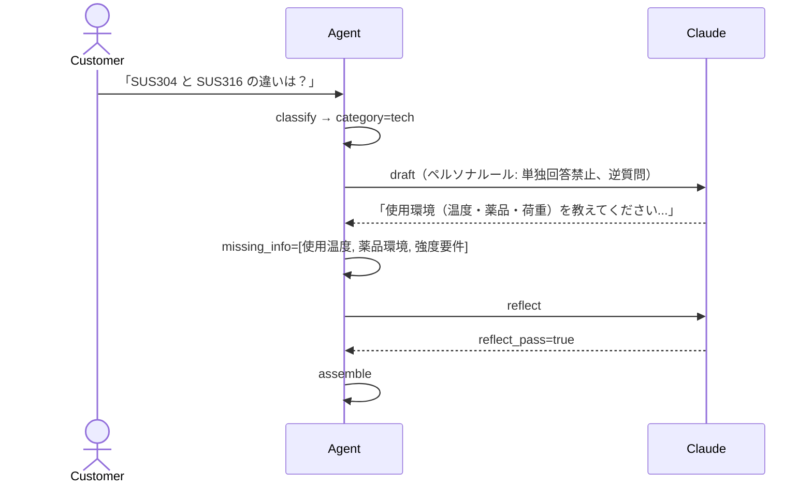
```mermaid
sequenceDiagram
    actor C as Customer
    participant A as Agent
    participant LLM as Claude
    C->>A: 「SUS304 と SUS316 の違いは？」
    A->>A: classify → category=tech
    A->>LLM: draft（ペルソナルール: 単独回答禁止、逆質問）
    LLM-->>A: 「使用環境（温度・薬品・荷重）を教えてください...」
    A->>A: missing_info=[使用温度, 薬品環境, 強度要件]
    A->>LLM: reflect
    LLM-->>A: reflect_pass=true
    A->>A: assemble
```

### 5-5. 失敗系: LLM API ダウン

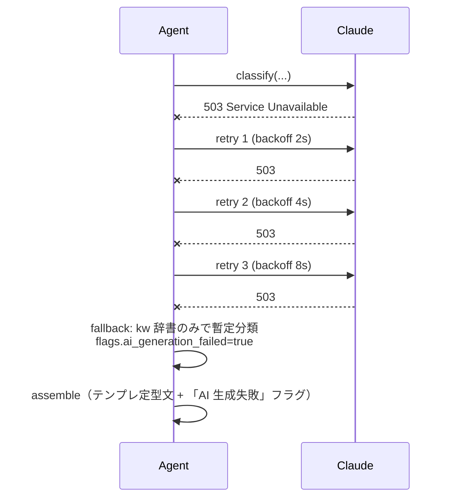
```mermaid
sequenceDiagram
    participant A as Agent
    participant LLM as Claude
    A->>LLM: classify(...)
    LLM--xA: 503 Service Unavailable
    A->>LLM: retry 1 (backoff 2s)
    LLM--xA: 503
    A->>LLM: retry 2 (backoff 4s)
    LLM--xA: 503
    A->>LLM: retry 3 (backoff 8s)
    LLM--xA: 503
    A->>A: fallback: kw 辞書のみで暫定分類<br/>flags.ai_generation_failed=true
    A->>A: assemble（テンプレ定型文 + 「AI 生成失敗」フラグ）
```

### 5-6. 失敗系: 抽出型番が DB にない

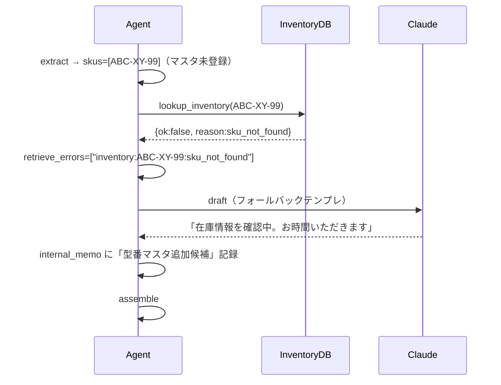
```mermaid
sequenceDiagram
    participant A as Agent
    participant Inv as InventoryDB
    participant LLM as Claude
    A->>A: extract → skus=[ABC-XY-99]（マスタ未登録）
    A->>Inv: lookup_inventory(ABC-XY-99)
    Inv-->>A: {ok:false, reason:sku_not_found}
    A->>A: retrieve_errors=["inventory:ABC-XY-99:sku_not_found"]
    A->>LLM: draft（フォールバックテンプレ）
    LLM-->>A: 「在庫情報を確認中。お時間いただきます」
    A->>A: internal_memo に「型番マスタ追加候補」記録
    A->>A: assemble
```

---

## 6. 状態遷移図

### 6-1. ケースのライフサイクル（運用視点）

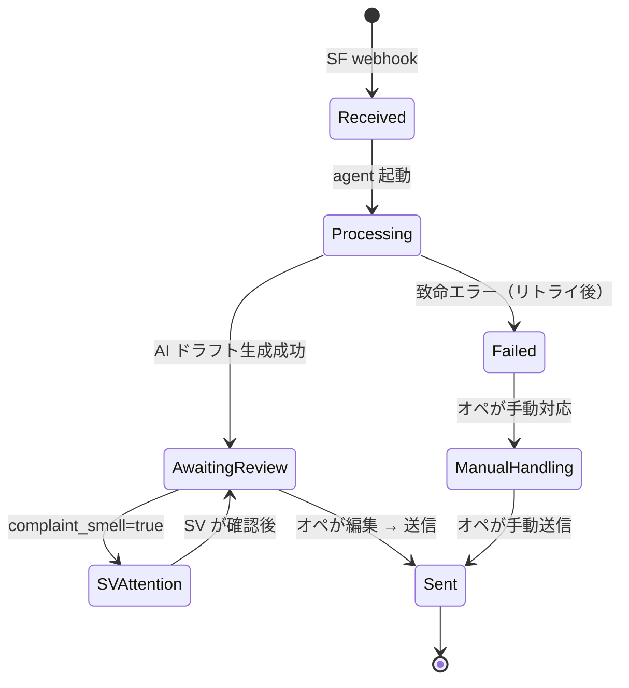
```mermaid
stateDiagram-v2
    [*] --> Received: SF webhook
    Received --> Processing: agent 起動
    Processing --> AwaitingReview: AI ドラフト生成成功
    Processing --> Failed: 致命エラー（リトライ後）
    Failed --> ManualHandling: オペが手動対応
    AwaitingReview --> SVAttention: complaint_smell=true
    SVAttention --> AwaitingReview: SV が確認後
    AwaitingReview --> Sent: オペが編集 → 送信
    ManualHandling --> Sent: オペが手動送信
    Sent --> [*]
```

### 6-2. State の有効フィールド遷移（実装視点）

各ノードを通過すると state にフィールドが追加される。**未通過ノードのフィールドは undefined**。

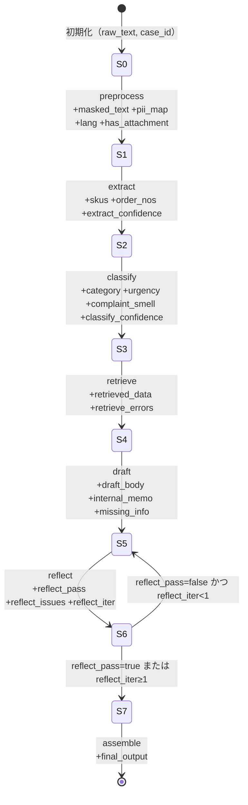
```mermaid
stateDiagram-v2
    [*] --> S0: 初期化（raw_text, case_id）
    S0 --> S1: preprocess<br/>+masked_text +pii_map +lang +has_attachment
    S1 --> S2: extract<br/>+skus +order_nos +extract_confidence
    S2 --> S3: classify<br/>+category +urgency +complaint_smell +classify_confidence
    S3 --> S4: retrieve<br/>+retrieved_data +retrieve_errors
    S4 --> S5: draft<br/>+draft_body +internal_memo +missing_info
    S5 --> S6: reflect<br/>+reflect_pass +reflect_issues +reflect_iter
    S6 --> S5: reflect_pass=false かつ reflect_iter<1
    S6 --> S7: reflect_pass=true または reflect_iter≥1
    S7 --> [*]: assemble<br/>+final_output
```

---

## 7. アクティビティ図（主要分岐）

### 7-1. classify ノードの内部フロー

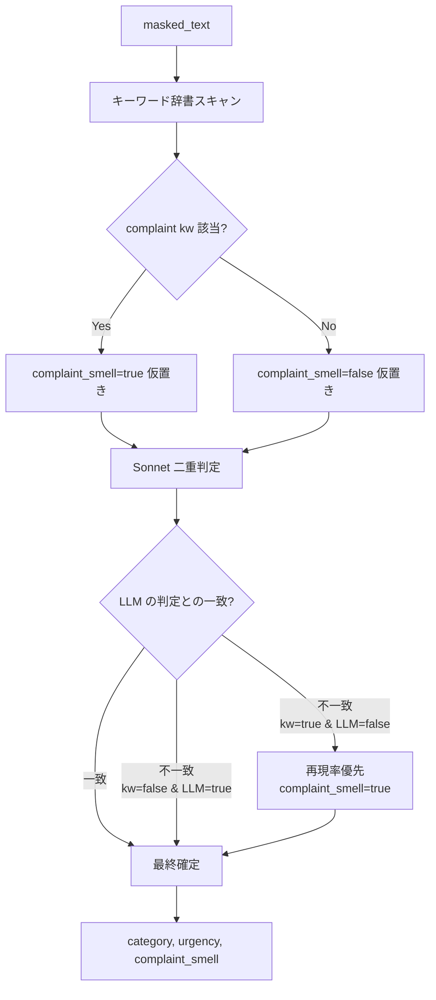
```mermaid
flowchart TD
    A[masked_text] --> B[キーワード辞書スキャン]
    B --> C{complaint kw 該当?}
    C -- Yes --> D[complaint_smell=true 仮置き]
    C -- No --> E[complaint_smell=false 仮置き]
    D --> F[Sonnet 二重判定]
    E --> F
    F --> G{LLM の判定との一致?}
    G -- 一致 --> H[最終確定]
    G -- 不一致<br/>kw=true & LLM=false --> I[再現率優先<br/>complaint_smell=true]
    G -- 不一致<br/>kw=false & LLM=true --> H
    I --> H
    H --> J[category, urgency, complaint_smell]
```

### 7-2. retrieve ノード内のディスパッチ

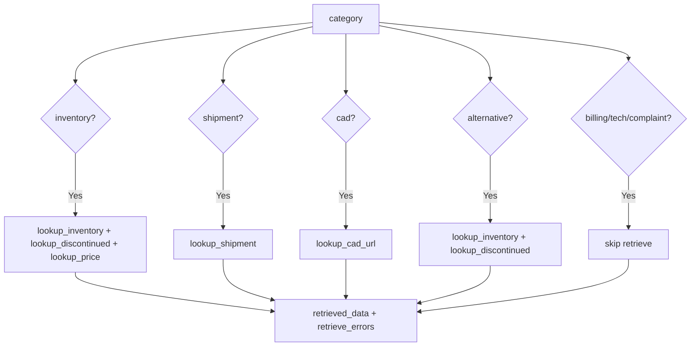
```mermaid
flowchart TD
    A[category] --> B{inventory?}
    B -- Yes --> C[lookup_inventory + lookup_discontinued + lookup_price]
    A --> D{shipment?}
    D -- Yes --> E[lookup_shipment]
    A --> F{cad?}
    F -- Yes --> G[lookup_cad_url]
    A --> H{alternative?}
    H -- Yes --> I[lookup_inventory + lookup_discontinued]
    A --> J{billing/tech/complaint?}
    J -- Yes --> K[skip retrieve]
    C & E & G & I & K --> L[retrieved_data + retrieve_errors]
```

### 7-3. reflect ノードのチェックリスト

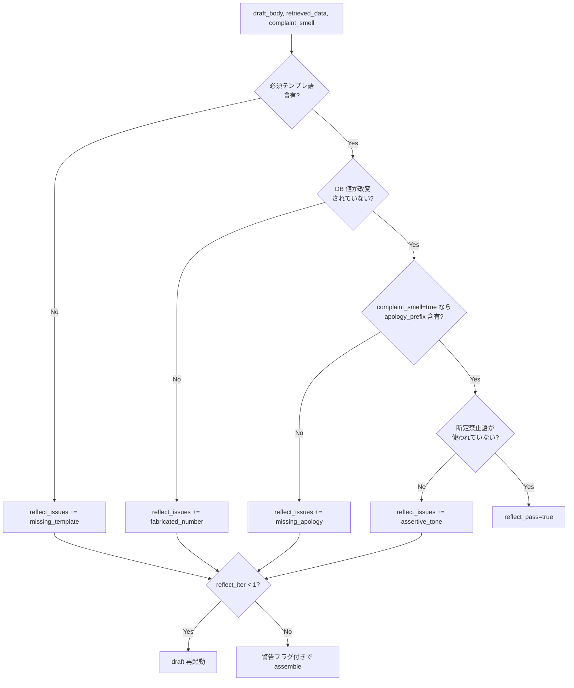
```mermaid
flowchart TD
    A[draft_body, retrieved_data, complaint_smell] --> B{必須テンプレ語<br/>含有?}
    B -- No --> X[reflect_issues += missing_template]
    B -- Yes --> C{DB 値が改変<br/>されていない?}
    C -- No --> Y[reflect_issues += fabricated_number]
    C -- Yes --> D{complaint_smell=true なら<br/>apology_prefix 含有?}
    D -- No --> Z[reflect_issues += missing_apology]
    D -- Yes --> E{断定禁止語が<br/>使われていない?}
    E -- No --> W[reflect_issues += assertive_tone]
    E -- Yes --> P[reflect_pass=true]
    X & Y & Z & W --> Q{reflect_iter < 1?}
    Q -- Yes --> R[draft 再起動]
    Q -- No --> S[警告フラグ付きで assemble]
```

---

## 8. インターフェース仕様（公開関数一覧）

### 8-1. `src/preprocess.py`

| 関数 | シグネチャ | 副作用 | 例外 |
|---|---|---|---|
| `preprocess_node` | `(state: TriageState, cfg: dict) -> dict` | なし | なし |
| `mask_pii` | `(text: str) -> tuple[str, dict[str, str]]` | なし | なし |
| `detect_lang` | `(text: str) -> Literal["ja","en","other"]` | なし | なし |
| `detect_attachment_marker` | `(text: str) -> bool` | なし | なし |

### 8-2. `src/extract.py`

| 関数 | シグネチャ | キャッシュ |
|---|---|---|
| `extract_node` | `(state: TriageState, cfg: dict) -> dict` | なし |
| `extract_skus` | `(text: str, patterns: list) -> list[str]` | なし |
| `extract_order_nos` | `(text: str, patterns: list) -> list[str]` | なし |

### 8-3. `src/classify.py`

| 関数 | シグネチャ | 副作用 |
|---|---|---|
| `classify_node` | `(state: TriageState, cfg: dict) -> dict` | LLM API 呼び出し |
| `keyword_scan` | `(text: str, kw_dict: dict) -> dict` | なし |

### 8-4. `src/retrieve.py`

| 関数 | シグネチャ | キャッシュ |
|---|---|---|
| `retrieve_node` | `(state: TriageState, cfg: dict) -> dict` | tools.md 各 lookup |
| `lookup_inventory` | `(sku: str) -> dict` | dict cache, key=(sku,) |
| `lookup_price` | `(sku: str, customer_id: Optional[str]) -> dict` | dict cache |
| `lookup_shipment` | `(order_no: str) -> dict` | dict cache |
| `lookup_discontinued` | `(sku: str) -> dict` | dict cache |
| `lookup_cad_url` | `(sku: str) -> dict` | dict cache |
| `clear_tool_cache` | `() -> None` | キャッシュクリア |

### 8-5. `src/draft.py`

| 関数 | シグネチャ | 副作用 |
|---|---|---|
| `draft_node` | `(state: TriageState, cfg: dict) -> dict` | LLM API 呼び出し |

### 8-6. `src/reflect.py`

| 関数 | シグネチャ | 副作用 |
|---|---|---|
| `reflect_node` | `(state: TriageState, cfg: dict) -> dict` | LLM API 呼び出し |

### 8-7. `src/assemble.py`

| 関数 | シグネチャ | 副作用 |
|---|---|---|
| `assemble_node` | `(state: TriageState, cfg: dict) -> dict` | unmask + JSON 出力 |
| `unmask` | `(text: str, pii_map: dict) -> str` | なし |

---

## 9. エラー処理・例外フロー

### 9-1. ノード別の失敗ハンドリング

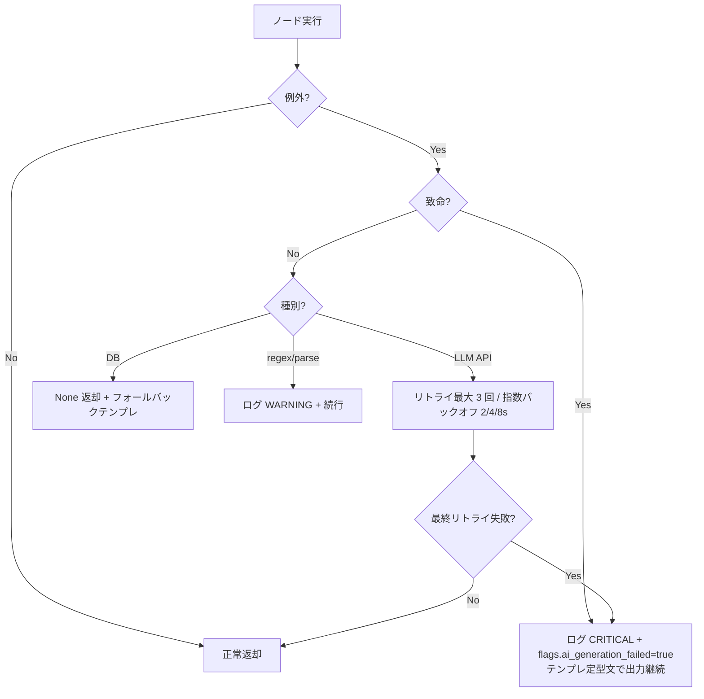
```mermaid
flowchart TD
    A[ノード実行] --> B{例外?}
    B -- No --> C[正常返却]
    B -- Yes --> D{致命?}
    D -- Yes --> E[ログ CRITICAL + flags.ai_generation_failed=true<br/>テンプレ定型文で出力継続]
    D -- No --> F{種別?}
    F -- LLM API --> G[リトライ最大 3 回 / 指数バックオフ 2/4/8s]
    F -- DB --> H[None 返却 + フォールバックテンプレ]
    F -- regex/parse --> I[ログ WARNING + 続行]
    G --> J{最終リトライ失敗?}
    J -- Yes --> E
    J -- No --> C
```

### 9-2. リトライ戦略

| 操作 | 最大回数 | バックオフ | フォールバック |
|---|---|---|---|
| LLM API | 3 | 指数 2,4,8s | テンプレ応答 + ai_generation_failed フラグ |
| DB（lookup_*） | 1（即 fallback） | - | `{"ok":false, "reason":"db_unavailable"}` |
| Salesforce 書き込み | 3 | 指数 2,4,8s | キューに退避 + Slack 通知 |

### 9-3. 致命エラーの定義

| 種別 | 検知方法 | 通知先 | 復旧 |
|---|---|---|---|
| PII マスキング漏れ警告 | `pii_map["__warning__"]` 存在 | 内部メモに警告 + Datadog アラート | 月次監査で照合 |
| LLM API 連続 3 回失敗 | リトライカウント | Slack #cs-alerts | テンプレで継続、オペ手動 |
| DB 全断（5 種すべて失敗）| `retrieve_errors` 全要素 | Slack #cs-alerts | テンプレで継続 |
| コスト上限超過 | `cost_usd > max_per_request` | Slack #cs-alerts | 軽量モード強制 or 中断 |

---

## 10. ロギング・監視

### 10-1. ログレベル運用

| レベル | 用途 | 例 |
|---|---|---|
| DEBUG | 各 LLM 呼び出しの prompt / response（PII マスク済みのみ） | `[draft] prompt_hash=abc, output_chars=521` |
| INFO | 各ノード開始/終了/件数 | `[1/7] preprocess case_id=5005...001234 lang=ja` |
| WARNING | フォールバック発火、DB 単発失敗 | `lookup_inventory failed: db_unavailable` |
| ERROR | リトライ後失敗、ノード単発エラー（続行）| `LLM API 3 retries exhausted` |
| CRITICAL | 致命（要人手）| `PII masking warning: unmaskable_pattern` |

### 10-2. メトリクス（Datadog）

| メトリクス | 単位 | 用途 |
|---|---|---|
| `agent.processed_count` | counter | スループット、カテゴリタグ付与 |
| `agent.latency_seconds` | histogram | P95 レイテンシ目標 30s |
| `agent.cost_usd_per_request` | gauge | 1 件コスト目標 $0.05 |
| `agent.complaint_detected_count` | counter | クレーム匂い件数 |
| `agent.reflect_iter_count` | histogram | 平均ループ回数（< 0.3 が目標） |
| `agent.db_lookup_failure_rate` | gauge | DB 失敗率（< 1% が目標） |
| `agent.llm_api_5xx_rate` | gauge | LLM API 失敗率 |
| `agent.pii_warning_count` | counter | PII マスキング警告件数 |

---

## 11. 性能・コスト試算

### 11-1. レイテンシ予算（P95）


```mermaid
gantt
    title 1 リクエスト処理時間（P95、標準モード）
    dateFormat X
    axisFormat %S秒
    section ノード
    preprocess (~50ms) :a1, 0, 50
    extract (~150ms) :a2, 50, 200
    classify (Sonnet ~3s) :a3, 200, 3200
    retrieve (DB 5 並列 ~500ms) :a4, 3200, 3700
    draft (Sonnet ~5s) :a5, 3700, 8700
    reflect (Sonnet ~3s) :a6, 8700, 11700
    assemble (~100ms) :a7, 11700, 11800
    SF 書き込み (~200ms) :a8, 11800, 12000
```

→ 標準モード合計 **約 12 秒**（P50）/ **約 20 秒**（P95、Reflection 1 回ループ含む）。spec §10-2 の **30 秒以内** に収まる。

軽量モード（Haiku のみ）はおよそ半分（**5〜8 秒**）。

### 11-2. コスト試算（再掲、design.md §6 と同じ）

| ノード | モデル | 入力 | 出力 | コスト |
|---|---|---|---|---|
| extract（補完）| Haiku 4.5 | 500 | 100 | $0.0008 |
| classify | Sonnet 4.6 | 800 | 150 | $0.0046 |
| draft | Sonnet 4.6 | 1,500 | 500 | $0.0120 |
| reflect | Sonnet 4.6 | 2,000 | 200 | $0.0090 |
| **合計** | | | | **約 $0.027/件** |

> モデル単価: Sonnet 4.6 = $3/M input, $15/M output。Haiku 4.5 = $0.80/M input, $4/M output（2026-01 公開価格、運用前に最新を確認）。

---

## 12. セキュリティ要件

### 12-1. データの流れ（PII / 機密情報）

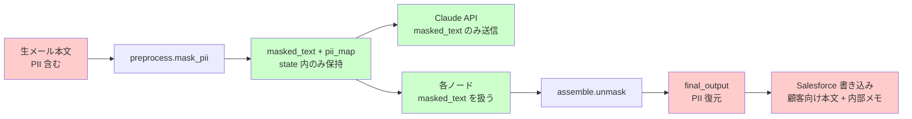
```mermaid
flowchart LR
    A[生メール本文<br/>PII 含む] --> B[preprocess.mask_pii]
    B --> C[masked_text + pii_map<br/>state 内のみ保持]
    C --> D[Claude API<br/>masked_text のみ送信]
    C --> E[各ノード<br/>masked_text を扱う]
    E --> F[assemble.unmask]
    F --> G[final_output<br/>PII 復元]
    G --> H[Salesforce 書き込み<br/>顧客向け本文 + 内部メモ]
    style A fill:#ffcccc
    style C fill:#ccffcc
    style D fill:#ccffcc
    style E fill:#ccffcc
    style G fill:#ffcccc
    style H fill:#ffcccc
```

- 生 PII → 赤
- マスク済み → 緑
- LLM API には **緑のみ送信**

### 12-2. アクセス制御

| 項目 | アクセス可 | 認証 |
|---|---|---|
| 在庫 / 出荷 / 廃番 DB | read-only ビュー | Okta SSO + サービスアカウント |
| 価格 DB（ERP API）| read:price スコープ | OAuth（Okta SSO 経由） |
| Salesforce ケース | ケース更新 + AI ドラフトタブ書き込み | サービスアカウント（API ユーザ） |
| Slack | #cs-alerts への投稿のみ | bot token（最小権限） |
| Anthropic API | 通常呼び出し | API キー（Vault 経由）|

### 12-3. 監査要件

| 要件 | 実装 |
|---|---|
| 月次 PII 監査 | ランダム 100 件をマスキング前後で照合（PII_AUDIT_LOG ハッシュで突合）|
| AI ドラフト使用率 | CRM の「AI 生成ドラフト使用」フラグを月次レポート |
| クレーム検出ログ | complaint_smell=true ケースを月次集計、SV が抜き取り精査 |
| コスト監査 | Datadog で日次サマリ + 月次予算消化率 |

---

## 13. テスト戦略

### 13-1. テストピラミッド

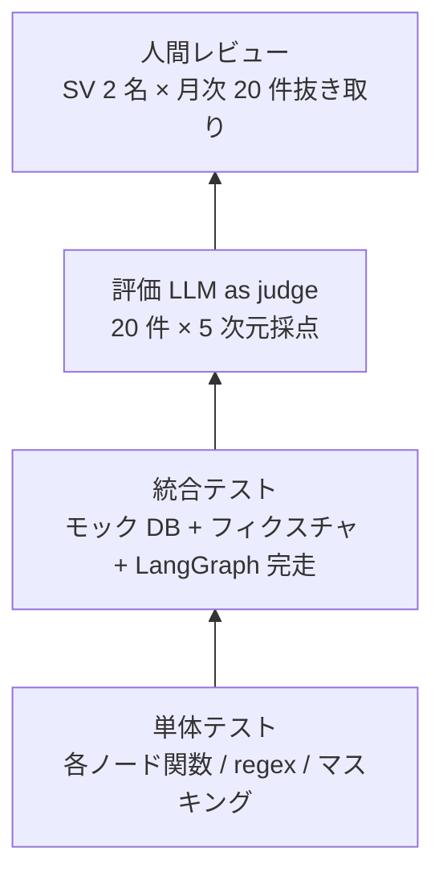
```mermaid
graph BT
    A[単体テスト<br/>各ノード関数 / regex / マスキング] --> B[統合テスト<br/>モック DB + フィクスチャ + LangGraph 完走]
    B --> C[評価 LLM as judge<br/>20 件 × 5 次元採点]
    C --> D[人間レビュー<br/>SV 2 名 × 月次 20 件抜き取り]
```

### 13-2. 単体テスト対象

| モジュール | テストケース例 | 件数目安 |
|---|---|---|
| `pii_mask.py` | 正常マスク / 漏れ検知 / 多重出現の同一プレースホルダ | 30+ |
| `extract.py` | 標準型番抽出 / 注文番号誤マッチ防止 / 既知の貪欲マッチバグ固定 | 20+ |
| `classify.py` (kw_scan) | 単一 kw / 複数 kw / 否定語 / 大文字小文字 | 15 |
| `retrieve.py` (各 lookup) | 正常系 / マスタ未登録 / DB 不通 | 各 3 = 15 |
| `assemble.py` (unmask) | 全プレースホルダの逆置換 / pii_map 欠損時 | 5 |

### 13-3. 評価データセット拡充計画

| フェーズ | 件数 | ソース |
|---|---|---|
| v1 prototype 完了時 | 20 件 | 合成データ（カテゴリ別 4/4/3/3/3/3） |
| v1 eval 完了時 | 30 件 | 合成 20 + 手で書き起こし 10 |
| v1 deploy β | 50 件 | 上記 + 本番ログから 20 件抜粋（PII マスク後） |
| v2 リリース時 | 100 件 | 本番ログ蓄積 + 「うまくいかなかったケース」抜粋 |

### 13-4. 品質ゲート

| フェーズ | 通過基準 |
|---|---|
| prototype 完了 | コンパイル + dry-run 完走 + 単体テスト 70+ 件パス |
| eval 完了 | 型番抽出 95%+ / クレーム再現率 95%+ / 必須テンプレ語 100% / コスト $0.05 以下 |
| deploy β 開始 | LLM Judge 平均 3.5+ / SV 抜き取り 5 段階 4.0+ |
| 本番昇格 | 1 ヶ月シャドー運用で誤回答ゼロ + オペ採用率 50%+ |

---

## 14. 改訂履歴

| バージョン | 日付 | 変更内容 |
|---|---|---|
| v1.0 | 2026-05-08 | 初版（agent-decompose）。spec.md v1 を起点に 7 ノード構成・Tool Use + Reflection ハイブリッド設計を確定 |

---

## 付録 A: ファイル構成チェックリスト

- [x] `spec.md`
- [x] `design.md`
- [x] `tools.md`
- [x] `detailed_design.md`（本書）
- [x] `hearing_notes.md`
- [x] `usecase_catalog.md`
- [ ] `scripts/agent.py`（prototype 後）
- [ ] `scripts/src/*.py`（prototype 後）
- [ ] `scripts/config/cs_triage.yaml`（prototype 後）
- [ ] `scripts/eval/dataset/`（eval 後）
- [x] `reports/discover_report.md`
- [ ] `reports/decompose_report.md`（本タスクで追加）
- [ ] `reports/prototype_report.md`（prototype 後）
- [ ] `reports/eval_report.md`（eval 後）

---

## 付録 B: 用語集

| 用語 | 説明 |
|---|---|
| **PII** | Personally Identifiable Information（個人情報）。氏名・電話・住所・メール |
| **SKU** | Stock Keeping Unit（型番）。例: `SHA-M6-20-N` |
| **クレーム匂い** | 文中のキーワードや文体パターンから「クレームに発展しそう」と判定する兆候 |
| **エディトリアル・ペルソナ** | システムプロンプトに注入する「ベテランオペの判断スキル」の人格 |
| **軽量モード** | Sonnet ではなく Haiku のみで処理する低コストモード（spec §10-1） |
| **Reflection** | LLM が自分の出力を再評価して改善するパターン（design §3） |
| **TypedDict 罠** | LangGraph の StateGraph は宣言外フィールドを silent drop する（AGENT_MINDSET.md） |

---

## 付録 C: 既存リファレンス実装との比較

`workspace/cs_triage_agent/v1/detailed_design.md`（9 ノード、約 1100 行）と本書（7 ノード、本書）の主な差分:

| 観点 | リファレンス v1 | 本 v3 v1 |
|---|---|---|
| ノード数 | 9 | 7 |
| 軽量モード起動 | `cs_triage_lite.yaml` で別実行 | classify 結果で自動切替 |
| Reflection | あり | あり（最大 1 回） |
| シーケンス図 | 7 本 | 6 本（必要十分にスリム化） |
| Tool Use | 関数ノード（疑似 Tool Use） | 同方針 |

設計の核（マスキング・ハイブリッド・Reflection）は共通。本 v3 はノード分割の整理と YAML 駆動の明示が改善点。

---

## 詳細設計書を書くコツ（実プロジェクト経験から）

1. **シーケンス図は最低 5 本**: 正常系 / 主要バリエーション 2-3 / 失敗系 2-3 → 本書は 6 本
2. **状態遷移は 2 つ視点で**: 運用視点（チケットライフサイクル）と 実装視点（state フィールド遷移）→ 両方記載
3. **エラー処理は flowchart で書く**: 「致命 vs 続行」の分岐が明確になる → §9-1 参照
4. **データの流れは色付きで**: PII 含む箇所（赤）と マスク済み（緑）を視覚的に区別 → §12-1 参照
5. **Gantt でレイテンシ予算**: 各ノードの所要時間を数値で書くと、後で実測との乖離が見える → §11-1 参照
6. **付録のチェックリストを使う**: ファイル構成漏れの防止 → 付録 A 参照
