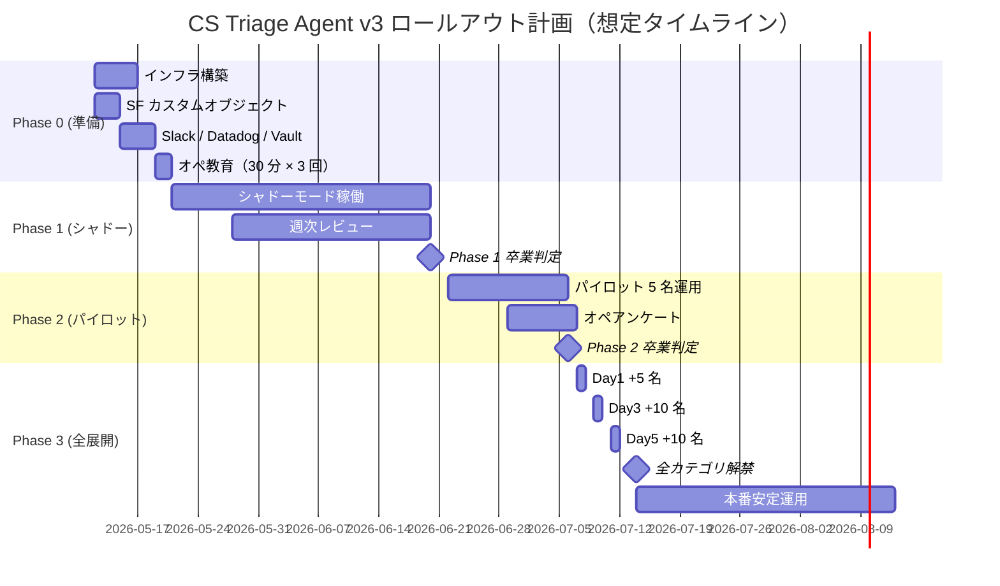

# 段階的ロールアウト計画 — CS Triage Agent v3

> 4 フェーズで段階的に本番投入する計画。`reference/rollout_template.md` をベースに本プロジェクト固有の値で具体化。

---

## ロールアウトの 4 フェーズ



合計約 1.5 ヶ月（Phase 0〜3 完了まで）+ 1 ヶ月（本番安定確認）= 2.5 ヶ月の想定。

---

## Phase 0: 準備（1 週間）

### やること
- [ ] K8s namespace `cs-triage-prod` セットアップ（SE 工藤）
- [ ] SF カスタムオブジェクト `AI_Draft__c` 作成 + Apex Trigger（SE 工藤）
- [ ] Outbound Message → webhook-receiver の経路設定
- [ ] HashiCorp Vault のシークレットパス整備 + K8s Secret 注入
- [ ] Datadog ダッシュボード + Monitor 10 件設定（runbook §アラート閾値 参照）
- [ ] 障害ランブック準備（`v3/ops/runbook.md` 印刷 + #cs-system-alerts pin）
- [ ] オペ教育セッション（30 分 × 3 回、CS センター長 主管）:
  - セッション 1: AI ドラフトとは何か / 何ができないか
  - セッション 2: SF UI での操作（採用 / 編集 / 拒否）
  - セッション 3: クレーム取消ボタン / フィードバック手順

### 卒業基準
- [ ] 全コンポーネントのヘルスチェック OK（webhook-receiver / agent-worker / Slack / DD）
- [ ] エンドツーエンドのスモークテスト 1 件通過（test ケース 1 件を実 LLM で完走）
- [ ] runbook を全関係者が一読済み

---

## Phase 1: シャドーモード（1 ヶ月）

### 概要
- agent が動いて出力を生成するが、**SF AI_Draft__c への書き込み機能は OFF**
- オペは「自分で本文を書いて送信」を継続
- 並行して agent の出力を `data/shadow_drafts/<case_id>.json` に蓄積し、SV が日次でレビュー
- 「使えそう度」を週次でアンケート（Slack `#cs-shadow-feedback`）

### やること
- [ ] `cfg.runtime.shadow_mode = true` で稼働（SF 書き込みなし、ファイル出力のみ）
- [ ] SV による週次レビュー（毎週金曜 30 分）:
  - 蓄積された shadow draft 50 件をランダムサンプル
  - 採用可（編集なしで送信できる）/ 軽微編集 / 大幅編集 / 不採用 で分類
  - false complaint flag / 過検知率を集計
- [ ] オペアンケート（週次）:
  - 「shadow draft が手動応対の参考になるか」を Likert 1-5
  - 困った点・誤りパターンを Slack で報告
- [ ] eval/dataset/ に shadow ログから「うまくいかなかったケース」を昇格（PII マスク後）
- [ ] 軽微改修（YAML キーワード追加・テンプレ調整）は同 v3 内で実施
- [ ] 大幅改修（プロンプト変更・新ノード）は v3.1 / v3.5 / v4 に積む

### 卒業基準（Phase 1 → Phase 2）

| 基準 | 閾値 | 計測 |
|---|---|---|
| 人間との agreement 率（カテゴリ判定）| ≥ 85% | SV 週次レビュー累計 |
| **クリティカルエラー** | **0 件**（絶対条件）| PII 漏れ / 内部 URL 漏れ / 致命的誤回答 |
| LLM Judge overall（v3.1 修正後）| ≥ 4.0 | eval 全件再実行 |
| 採用可 + 軽微編集合計 | ≥ 60% | SV レビュー累計 |
| クレーム見逃し（recall）| 0 件 | SV 抜き取り |

### NG ケース → Phase 1 延長（最大 +2 週間）
- クリティカルエラー 1 件でも発生 → 原因究明 + 修正 + 再開
- agreement 75% 未満 → カテゴリプロンプト見直し
- 採用率 50% 未満 → ペルソナ / DB 値ポリシー見直し

---

## Phase 2: パイロット（2 週間）

### 概要
- **SF 書き込み機能 ON**（オペが AI_Draft__c を実際に CRM 上で使う）
- ベテランオペ 3 名 + 中堅 1 名 + 新人 1 名 の 5 名で限定運用
- それ以外のオペは引き続き shadow draft 参照（任意）
- パイロット参加者には Slack `#cs-triage-pilot` チャンネルで日次フィードバック収集

### やること
- [ ] パイロット参加者の SF プロファイル設定（AI_Draft__c の閲覧 + 編集権限付与）
- [ ] `flags.ai_generation_used` フラグの集計ジョブ稼働（毎日 0:00 集計）
- [ ] 日次スタンドアップ（CS 部、15 分）:
  - 前日のパイロット運用状況
  - うまくいかなかったケース報告
  - 即対応が必要な改修（YAML 編集レベル）の判断
- [ ] 法務 大野による週次 PII 監査（手動）
- [ ] パイロット完了時アンケート:
  - オペ採用率（自己申告）
  - 編集量（無編集 / 軽微 / 大幅）
  - 体感の応対時間短縮（spec §9 目標: 6 分 → 4 分）

### 卒業基準（Phase 2 → Phase 3）

| 基準 | 閾値 |
|---|---|
| パイロットでの採用率 | **≥ 60%**（無編集 + 軽微編集の合計）|
| クリティカルエラー | **0 件**（パイロット 2 週間で）|
| 体感応対時間短縮 | ≥ 20%（オペ自己申告アンケート）|
| クレーム見逃し | 0 件（SV 監査）|
| LLM Judge overall | ≥ 4.0（v3.1 修正後）|

---

## Phase 3: 全展開（1 週間で 30 名）

### 概要
段階的にオペ全員（30 名想定）に展開。

```
Day 1 (月): パイロット 5 名 + 5 名追加 = 10 名
Day 3 (水): + 10 名 = 20 名
Day 5 (金): + 10 名 = 30 名（全員）
```

各 Day で 24 時間モニタリング後、問題なければ次 Day で追加展開。

### やること
- [ ] 各 Day で kubectl scale で agent-worker を増強（10 → 20 → 30 名分の負荷想定）
- [ ] Datadog でレイテンシ・コスト・採用率を 24 時間モニタ
- [ ] 問題発生時は前 Day の人数に戻す（`SF プロファイルから revoke`）
- [ ] Day 5 完了後の全社員教育（オプション、希望者向け 30 分セッション）

### 卒業基準（Phase 3 → 本番安定）

| 基準 | 閾値 |
|---|---|
| 全展開後 1 週間でクリティカルエラー | 0 件 |
| Datadog SLO 達成 | レイテンシ P95 < 30s / コスト < 月予算 80% |
| オペ採用率 | ≥ 50%（全員平均、Phase 2 比で許容範囲）|

---

## 本番安定運用（30 日）

### 観察期間
- Datadog SLO を 30 日連続でクリア
- 月次レビュー会（CS センター長 + SV 2 + SE 1）で課題棚卸
- v3.1（max_tokens / Judge プロンプト）/ v3.5（langdetect / lookup_case_history）/ v4（DSPy / Multi-Agent）の優先度議論

### 卒業基準
- [ ] 1 ヶ月連続でクリティカルエラー 0 件
- [ ] オペ採用率が安定（標準偏差 ±5pp 以内）
- [ ] コストが月予算 80% 以下で安定

→ 達成後、**本番安定運用**として継続改善サイクル（CHANGELOG / eval/dataset 拡充）に移行。

---

## ロールバック計画

### Phase 1（シャドー）→ 撤退
- `cfg.runtime.shadow_mode = true` のまま停止し、SF Apex Trigger を一時無効化
- データ消失なし（shadow draft は別ファイル保管）

### Phase 2/3 → Phase 1 戻し
- パイロット参加者の SF プロファイルから AI_Draft__c の編集権限 revoke
- Apex Trigger は稼働継続、書き込みは続けるが UI で見えなくなる
- shadow_drafts への二重書き込みで履歴保管

### 本番 → Phase 3 戻し
- agent-worker は稼働継続、SF UI 上で AI_Draft__c タブを非表示化
- ロールバック原因を CHANGELOG.md に記録、再起動時の改善計画を立てる

---

## ステークホルダー

| 役割 | 担当 | 主な責任 |
|---|---|---|
| プロダクトオーナー | CS センター長 富田 | KPI 達成判定、卒業基準合意、最終 GO/NO-GO |
| 業務リード | SV 阿部 | 週次レビュー、クレーム監査、過検知判定 |
| 技術リード | SE 工藤 | デプロイ実装、SF / DB / Slack 連携、ランブック実行 |
| 法務リード | 大野 | PII 監査、CAD URL 規程、改正個情法対応 |
| 開発（agent-builder） | - | v3.1 / v3.5 / v4 開発、CI 維持、評価サイクル運営 |
| エンドユーザー | オペ 30 名 | AI ドラフト採用 / 編集 / フィードバック報告 |

---

## 想定 KPI（Phase 3 完了時、最終目標）

| 指標 | 現状（v3 eval）| 本番目標 |
|---|---|---|
| 1 件あたり応対時間 | - | 6 分 → **4 分**（30% 短縮）|
| オペ採用率 | - | ≥ 50% |
| 新人独り立ち期間 | - | 3 ヶ月 → **1.5 ヶ月** |
| 誤回答による再問い合わせ件数 | - | 悪化させない（絶対条件）|
| 月コスト | $1,200（試算）| ≤ $3,000 |
| クレーム見逃し件数 | 0（v3 で recall 100%）| 0 維持 |
| 致命ミス（PII / 内部 URL / 大外し）| 0 維持 |

---

## 詳細

- 障害対応: `v3/ops/runbook.md`
- 運用設計: `v3/reports/deploy_design.md`
- 評価結果: `v3/reports/eval_report.md` + `v3/reports/evolve_v3_report.md`
- 業務合意: `data/hearing_round_2.md`
