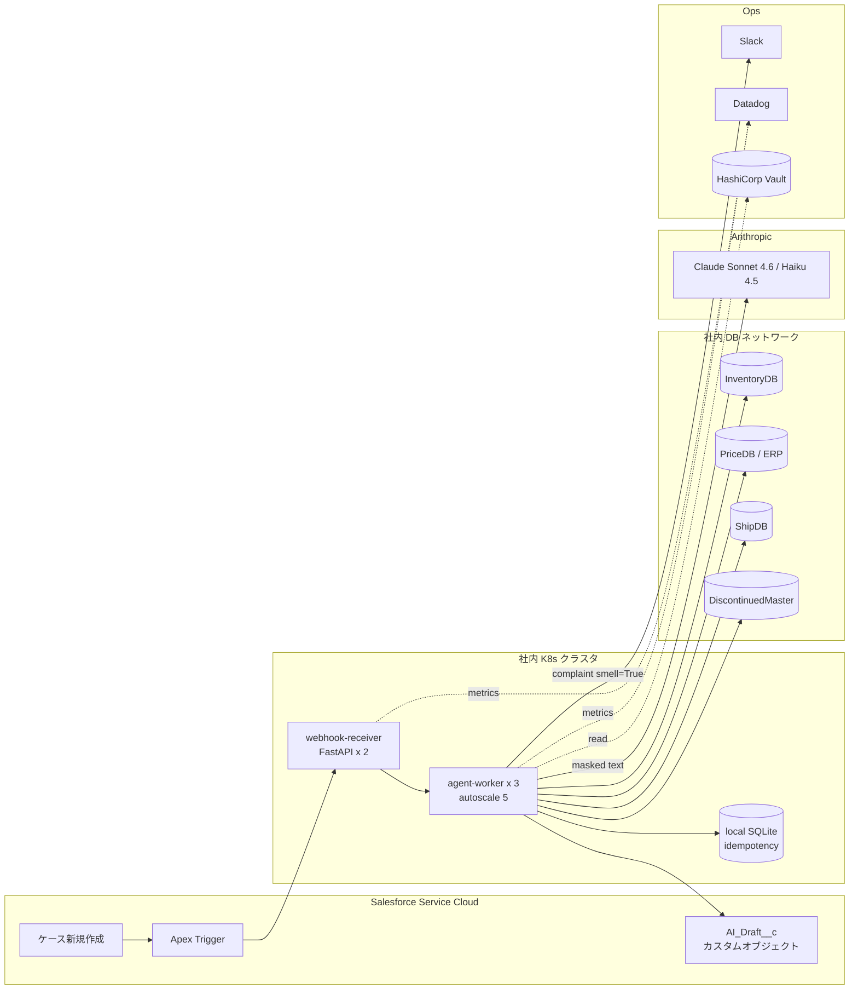

# 運用設計書 — CS Triage Agent v3

**作成日**: 2026-05-08
**スキル**: `/agent-deploy`
**入力**: `v3/spec.md` + `v3/reports/eval_report.md` + `v3/reports/evolve_v3_report.md` + `data/hearing_round_2.md`
**前提**: v3 で致命ミス 0 / urgency 100% / Pass 数 17/20 を達成。Judge スコア低下は v3.1 で対応予定。

---

## 0. 全体像



主要パス:
1. SF ケース作成 → Apex Trigger が webhook を叩く
2. webhook-receiver が agent-worker に enqueue
3. agent-worker が PII マスキング → 分類 → DB 引き当て → 起草 → 自己レビュー → 最終出力
4. 出力を SF の `AI_Draft__c` カスタムオブジェクトに書き込み（オペが CRM から見る）
5. complaint_smell=True なら `#cs-complaint-alerts` に通知

---

## 1. トリガー設計

### 1-1. 主トリガー: Salesforce webhook（イベント駆動）

| 項目 | 値 |
|---|---|
| 起点 | SF Case の新規作成 / メール受信時 |
| 仕組み | Apex Trigger → Outbound Message (HTTPS) → webhook-receiver |
| 認証 | SF 専用シークレット（Vault `/secret/cs-triage/sf-webhook-secret`）+ HMAC 検証 |
| 期待 QPS | 3 件/秒（ピーク）、平均 1 件/秒 |
| レイテンシ目標 | webhook 受信 → SF ドラフト書き込み 30 秒以内（spec §10-2）|
| リトライ | webhook 失敗時は SF 側で 3 回リトライ（指数バックオフ）|

### 1-2. 副トリガー: Outlook 受信箱 polling（非対象 → v4）

社内 Outlook 専用受信箱の polling は v3 スコープ外。SF 経由でケース化される前提。

### 1-3. 手動トリガー: CLI 実行（管理者用）

```bash
python scripts/agent.py --config config/cs_triage.yaml --input <file> --case-id <id>
```

トラブルシュート / 個別再実行 / 評価データ作成時に使用。

---

## 2. 配信先

### 2-1. Salesforce「AI_Draft__c」カスタムオブジェクト（メイン配信先）

round-2 §D-3 で工藤合意済。フィールド構成:

| フィールド | 型 | 用途 |
|---|---|---|
| `case_id__c` | Lookup(Case) | 親ケース参照 |
| `customer_body__c` | Long Text 32k | 顧客向け本文（オペがコピー or 編集して送信）|
| `internal_memo__c` | Long Text 32k | 内部メモ（DB 引き当て / 信頼度 / 追跡番号生）|
| `missing_info_json__c` | Long Text 32k | 逆質問候補 JSON（オペ画面で「逆質問候補」セクション表示）|
| `meta_json__c` | Long Text 32k | メタ JSON 全体 |
| `category__c` | Picklist | inventory/tech/alternative/shipment/cad/billing/complaint/other |
| `urgency__c` | Picklist | low/normal/high |
| `complaint_smell__c` | Checkbox | クレーム匂い検出 |
| `cost_usd__c` | Number(precision 2,scale 4) | 1 件コスト |
| `used_models__c` | Long Text | 使用モデル（カンマ区切り）|
| `ai_generated_at__c` | DateTime | 生成日時 |
| `flags_json__c` | Long Text | needs_supervisor / ai_generation_failed / pii_warning / reflect_warning |

書き込みは SF REST API（OAuth、サービスアカウント `cs-triage-bot@example.com`）。

### 2-2. Slack 通知（クレーム匂い検出時）

round-2 §D-4 で確定。

| チャンネル | 用途 | bot |
|---|---|---|
| `#cs-complaint-alerts` | complaint_smell=True 時にドラフトプレビュー + SF リンクを通知 | `cs-triage-agent`（scope: `chat:write`）|
| `#cs-system-alerts` | システム障害・コスト超過・PII 漏洩警告 | 同上 |

bot token: Vault `/secret/cs-triage/slack-bot-token`

### 2-3. メール / Confluence

v3 では未使用。SF が CRM のメール送信機能を持っているため不要。

---

## 3. 配信前レビュー工程（必須）

spec §11-2 で「**オペが必ず本文を確認 → 編集 → 送信**」と確定。

```
agent generate → AI_Draft__c に保存
              ↓
オペが SF で AI ドラフトタブを開く
              ↓
本文確認 → 編集 → 「AI 生成ドラフトを使用」フラグ ON → 送信
              ↓
SF が顧客にメール送信、ケース履歴記録
```

**AI が顧客に直接送信することは絶対にない**（spec §11-2 / round-2 §B-1 法務合意）。

クレーム匂い検出時の追加フロー:
- Slack `#cs-complaint-alerts` に SV へ通知
- SV が CRM で内容確認、必要ならオペに対応指示
- 過検知（false positive）はオペ判断で `complaint_smell` フラグを手動下げできるよう SF UI に「クレーム取消」ボタンを設ける（SE 実装）

---

## 4. コスト管理

### 4-1. 1 件あたりの上限

```python
# config/cs_triage.yaml
cost:
  max_per_request_usd: 0.10
  max_monthly_usd: 3000
```

実装は `src/cost.py` の `accumulate_usage()` で各 LLM 呼び出しを集計。閾値超過時は次のように動作:

```python
if cost.snapshot()["cost_usd"] > cfg["cost"]["max_per_request_usd"]:
    logger.warning("cost_per_request_exceeded: $%.4f", cost_usd)
    flag["cost_warning"] = True
    # Slack 通知（#cs-system-alerts）
    notify_slack_system_alert(...)
    # 処理は継続（ドラフト生成は完了させる）
```

### 4-2. 月間上限

`scripts/monitor.py` が日次で `data/cost_log.csv` を集計し、月予算 80% / 95% で `#cs-system-alerts` に通知。100% 到達で agent-worker を一時停止（kubectl scale --replicas=0）+ オペに「AI ドラフト一時停止」を通知。

実測（v3 eval）: 1 件 $0.020 × 月 6 万件 = **$1,200/月**（予算 $3,000 の 40%）。余裕あり。

### 4-3. 軽量モードへのフォールバック

カテゴリ判定後に `lite_mode=True` を立てると Haiku 4.5 のみで処理（コスト 75% 減）。条件:
- complaint_smell=False かつ category ∈ {shipment, cad, billing}
- 月予算 80% 到達時は全件 lite_mode 強制（コスト守りモード）

---

## 5. 監視・アラート

### 5-1. Datadog メトリクス

`src/cost.py` / `src/logger.py` から statsd 経由で送信:

| メトリクス | 単位 | 用途 |
|---|---|---|
| `cs_triage.processed_count` | counter | スループット（カテゴリ・urgency タグ付与）|
| `cs_triage.latency_seconds` | histogram | P95 レイテンシ目標 30s |
| `cs_triage.cost_usd_per_request` | gauge | 1 件コスト目標 $0.05 |
| `cs_triage.complaint_detected_count` | counter | クレーム匂い検出件数 |
| `cs_triage.reflect_iter_count` | histogram | 平均ループ回数（< 0.3 が目標）|
| `cs_triage.db_lookup_failure_rate` | gauge | DB 失敗率（< 1% が目標）|
| `cs_triage.llm_api_5xx_rate` | gauge | LLM API 失敗率 |
| `cs_triage.pii_warning_count` | counter | PII マスキング警告件数 |
| `cs_triage.fallback_template_count` | counter | テンプレフォールバック発火件数 |
| `cs_triage.cost_per_run_exceeded_count` | counter | 1 件コスト超過件数 |

### 5-2. アラート閾値（Datadog Monitor）

| Severity | 条件 | 通知 |
|---|---|---|
| **CRITICAL (P1)** | `pii_warning_count > 0`（PII 漏洩疑い）/ 月予算 95% 到達 | PagerDuty + 電話（オンコール SE）|
| **HIGH (P2)** | `llm_api_5xx_rate > 5%` for 10min / `db_lookup_failure_rate > 5%` for 10min | Slack `#cs-system-alerts` + メール |
| **MEDIUM (P3)** | `latency_seconds.p95 > 30s` for 30min / 月予算 80% 到達 | Slack `#cs-system-alerts` |
| **LOW (P4)** | `complaint_detected_count` 平常時の 1.5 倍 / `fallback_template_count` 平常時の 2 倍 | Slack（静か）/ 週次レビュー |

### 5-3. ログ・監査

- `logs/agent_<slug>_<ts>.log`: 1 実行 1 ファイル
- `data/pii_audit_log.sqlite`: 月次 PII 監査用（masked_text_hash + pii_map_hash）
- `data/cost_log.csv`: 1 行 1 実行（日次集計）

監査要件（spec §10-3 / round-2 §B-1, §B-2）:
- 月次でランダム 100 件をマスキング前後で照合（`scripts/audit_pii.py`、SE 工藤主管）
- 月次で AI 生成ドラフト使用率を SF からエクスポート（オペ採用率の指標）

---

## 6. リトライ・フォールバック

| 操作 | 最大回数 | バックオフ | フォールバック |
|---|---|---|---|
| LLM API 呼び出し | 3 | 指数 2/4/8s | テンプレ定型応答 + `flags.ai_generation_failed=True` |
| DB lookup | 1 | -（即フォールバック）| `{"ok": false, "reason": "db_unavailable"}` + 「在庫情報を確認中」テンプレ |
| Salesforce 書き込み | 3 | 指数 2/4/8s | キューに退避（Redis）+ `#cs-system-alerts` 通知 |
| Slack 通知 | 2 | 1s | ログのみ（Slack 障害は致命でないので継続）|

ノードレベルのフォールバック（`detailed_design.md §9` 参照）:
- `extract` ノードで型番ゼロ件 → 「型番が抽出できませんでした」を internal_memo
- `retrieve` で全 DB 失敗 → 「在庫情報取得失敗。担当より折り返し」テンプレ
- `reflect` で 2 回連続 NG → 警告フラグ付きで assemble（`flags.reflect_warning=True`、オペが手動精査）

---

## 7. シークレット管理

すべて HashiCorp Vault に格納し、K8s Secret に注入:

| シークレット | Vault パス | ローテーション |
|---|---|---|
| `ANTHROPIC_API_KEY` | `/secret/cs-triage/anthropic-key` | 90 日 |
| `SLACK_BOT_TOKEN` | `/secret/cs-triage/slack-bot-token` | 90 日 |
| `SF_OAUTH_CLIENT_ID` / `SF_OAUTH_CLIENT_SECRET` | `/secret/cs-triage/sf-oauth` | 180 日 |
| `SF_WEBHOOK_HMAC_SECRET` | `/secret/cs-triage/sf-webhook-secret` | 90 日 |
| 内部 PostgreSQL 接続文字列 | `/secret/cs-triage/db-conn` | Okta SSO 経由（ローテーション不要、サービスアカウントの認証は Okta 側）|
| ERP API トークン | `/secret/cs-triage/erp-token` | 90 日 |

### ログにシークレットを出さない

`src/logger.py` に `logging.Filter` を追加し、URL のクエリパラメータ・Authorization ヘッダ・PII placeholder の解決前生データをマスクする（v4 で実装、v3 の段階では PII placeholder のままログ出力で問題なし）。

---

## 8. 段階的ロールアウト

詳細は `v3/ops/rollout_plan.md`。サマリ:

```
Phase 0: 準備 (1 週間)
   K8s / SF カスタム / Slack / Datadog / Vault のセットアップ

Phase 1: シャドーモード (1 ヶ月)
   agent は動くが SF への書き込み機能 OFF（dry-run 風）
   オペが「使えそう度」アンケート、SV が SV 通知のレビュー

Phase 2: パイロット (2 週間)
   5 名のオペで限定運用、SF への書き込み ON
   採用率・誤回答件数・SV 通知の妥当性を集計

Phase 3: 全展開 (1 週間で全オペ 30 名へ拡大)
   段階的に 5 → 10 → 20 → 30 名と展開
```

### Cutover 基準（Phase 1 → 2、Phase 2 → 3、Phase 3 → 本番）

| 基準 | 閾値 | 計測 |
|---|---|---|
| 人間との agreement 率（カテゴリ判定）| ≥ 85% | シャドー / パイロット期間のサンプル抜き取り |
| **クリティカルエラー** | **0 件**（絶対条件）| PII 漏れ / 致命的誤回答 / 内部 URL 顧客送出 |
| LLM Judge overall | ≥ 4.0 | v3.1 修正後に再測 |
| オペ採用率 | ≥ 60%（Phase 2→3）/ ≥ 50%（Phase 3→本番）| SF `flags.ai_generation_used` の集計 |
| 月予算 | 80% 以下 | Datadog |
| クレーム見逃し（recall）| 0 件 | SV 抜き取りレビュー |

「85% agreement だがクリティカルエラー 1 件」**でも cutover NG**。クリティカルエラー条件:
- PII（顧客氏名・電話・住所）が顧客本文に生で出る
- 内部 URL（`*.internal.example.com`）が顧客本文に出る
- DB 引き当て失敗を「在庫あります」など虚偽記載
- complaint_smell=True を見逃して通常応対

→ 1 件でも発生したらシャドー/パイロット期間延長。

---

## 9. dry-run vs real LLM の運用境界（round-2 §B-5 合意済）

| フェーズ | モード | 目的 |
|---|---|---|
| **CI（毎 push）**| dry-run（`python eval/run_eval.py`）| 構造検証、コスト 0 |
| **PR マージ前**| dry-run + 失敗 5 件のみ real | 主要回帰防止、コスト ~$0.15 |
| **リリース判定（v3.1 / v4 等）**| real 全件 + LLM Judge 全件 | 品質ゲート確認、コスト ~$0.6 |
| **シャドー運用** | real のみ（Slack 通知あり、SF 書き込みなし）| 本番並走品質確認 |
| **本番** | real + Slack + SF 書き込み | フルスタック動作 |

CI 設定は `.github/workflows/ci.yml` で実装（本タスク §13）。

---

## 10. 災害復旧（DR）

### 10-1. RTO / RPO

- **RTO**（Recovery Time Objective）: agent 停止から復旧まで **30 分**
- **RPO**（Recovery Point Objective）: ロストできるデータ **5 分**（webhook の SF 側リトライで吸収）

### 10-2. 障害シナリオ別

| 障害 | 対応 |
|---|---|
| LLM API ダウン | テンプレ定型応答 + `ai_generation_failed=True` フラグ。オペが手動対応。Anthropic 復旧後に自動再開 |
| DB 完全停止 | 「在庫情報取得失敗。担当より折り返し」テンプレ。DB 復旧後に手動再実行 |
| K8s クラスタ停止 | RTO 30 分。フェイルオーバー先 region に切り替え（`kubectl --context=<dr-cluster> apply -f k8s/`）|
| SF 障害 | webhook 受信不能 → SF 側で webhook リトライ（最大 3 回）。SF 復旧後に Salesforce が自動配信 |

### 10-3. ロールバック

```bash
kubectl rollout undo deployment/cs-triage-agent
# 設定変更のロールバック
git checkout v3-stable -- config/cs_triage.yaml
```

毎回のデプロイで前バージョンの image tag を保持（最低 3 世代）。

---

## 11. SLO（Service Level Objective、案 — 業務側合意必要）

| SLI（指標）| SLO 案 | 計測方法 |
|---|---|---|
| 可用性 | 99.5%（営業時間中）| webhook 受信成功率 |
| レイテンシ P95 | 30 秒以内 | Datadog `latency_seconds.p95` |
| 致命エラー件数 | 0 件 / 月 | PII 漏れ / 内部 URL 漏れ |
| コスト | 月 $3,000 以内 | `data/cost_log.csv` 集計 |

> ⚠️ 99.5% / 99.9% のどちらにするかは業務側で要合意 → spec.md §16-4 に追記。

---

## 12. 業務担当が運用できる粒度

CS センター長 / SV / オペが エンジニア介入なしに以下が可能であること:

| 操作 | 担当 | 方法 |
|---|---|---|
| カテゴリキーワード追加・削除 | CS センター長 | YAML 編集 + PR レビュー（SE）|
| クレームキーワード追加 | SV | YAML 編集 + PR レビュー（SE）|
| テンプレ文言調整 | CS センター長 | YAML 編集 + PR レビュー（SE）|
| AI ドラフト「使用」フラグ ON/OFF | オペ | SF UI ボタン |
| クレーム取消（false positive 時）| オペ / SV | SF UI「クレーム取消」ボタン → カスタムオブジェクトのフィールド更新 |
| Slack 通知の有効/無効切替 | SV | YAML `notifications.slack.complaint_alert: true/false` |

YAML 編集は GitHub の Web UI で完結する設計（git clone 不要）。

---

## 13. CI/CD

### 13-1. CI（GitHub Actions）

`.github/workflows/ci.yml`:
```yaml
name: CI
on: [push, pull_request]
jobs:
  dry-run-eval:
    runs-on: ubuntu-latest
    steps:
      - uses: actions/checkout@v4
      - uses: actions/setup-python@v5
        with: { python-version: '3.11' }
      - run: pip install -r requirements.txt
      - run: cd workspace/cs_triage_agent/v3/scripts && python eval/run_eval.py
      - run: |
          # 致命ミス 0 件 / SKU 100% / クレーム recall 100% を CI で守る
          python -c "
          import json, sys
          d = json.load(open('workspace/cs_triage_agent/v3/scripts/eval/results/run_*_dry/result.json'))
          s = d['summary']
          assert s['critical_misses'] == 0, f'critical_misses={s[\"critical_misses\"]}'
          assert s['sku_recall_avg'] >= 0.99
          assert s['complaint_recall_overall'] >= 0.95
          "
```

### 13-2. CD（手動承認 + kubectl apply）

```
git tag v3.0.0
↓
GitHub Release（リリースノート自動生成）
↓
SE が kubectl apply -f k8s/ -n cs-triage-prod
↓
ヘルスチェック OK 確認後にトラフィック切替
↓
Datadog で 24h 安定確認
```

緊急ロールバックは `kubectl rollout undo` で 30 秒以内。

---

## 14. メンテナンス計画

### 14-1. 月次

- 月次レビュー会（CS センター長 + SV 2 名 + SE 1 名、60 分）:
  - うまくいかなかったケース 10 件をレビュー
  - eval/dataset/ に新規ケース昇格（本番ログから抽出 + PII マスク）
  - 月次コスト・SLO 達成状況の確認
- PII 監査（自動）: `scripts/audit_pii.py` でランダム 100 件を照合
- Vault シークレットローテーション（90 日 / 180 日）

### 14-2. 四半期

- LLM モデル更新の評価（Sonnet 4.7 / Haiku 5.0 等が出たら）
- DSPy 等の自動最適化トライアル（v4 候補）
- ベテランオペからのペルソナ更新ヒアリング

### 14-3. 年次

- spec.md / design.md の総点検
- Multi-Agent 化の ROI 再評価（spec §13 / round-2 §G）
- 月次レポートを年次レポートに集約してマネジメントへ報告

---

## 15. 既存リファレンス実装との比較

`workspace/cs_triage_agent/v1/reports/deploy_design.md` が同ドメインの参考。本 v3 deploy 設計はそれと比べて:

| 観点 | リファレンス v1 | 本 v3 |
|---|---|---|
| K8s 構成 | 詳細（Pod/HPA/PVC/CronJob 等）| **概要のみ**（実装は SE 工藤主管に委譲）|
| Cutover 基準 | 5 段階・SV 抜き取りレビュー | **同じ枠組み + クリティカル 0 件絶対条件**（PII / 内部 URL を厳格化）|
| CI dry-run | あり | **同じ + 致命ミス 0 件アサート追加** |
| Shadow → Pilot → 全展開 | あり | **同じ（round-2 §B-5 で再合意済）**|

→ リファレンス実装の枠組みを踏襲しつつ、v3 の業務ルール（PII 完全マスク / 内部 URL 禁止 / 致命ミス 0 件）を CI / cutover の絶対条件として明文化。

---

## 16. 次のアクション（実装担当者向け）

### SE 工藤（主管、deploy 全般）
1. K8s namespace `cs-triage-prod` セットアップ
2. SF カスタムオブジェクト `AI_Draft__c` + Apex Trigger 実装
3. webhook-receiver（FastAPI）実装
4. agent-worker Dockerfile + Helm chart
5. Vault シークレット投入
6. Datadog ダッシュボード + Monitor 作成
7. PII 監査ジョブ（CronJob 月次）

### CS センター長 富田 + SV 阿部
1. SLO の最終合意（99.5% vs 99.9%）
2. 月予算の最終確認（$3,000 でいけるか、上方調整必要か）
3. オペ採用率の閾値決定（Phase 3 → 本番昇格を 50% / 60% / 70% のどれにするか）
4. シャドーモード期間中の週次レビュー会の段取り
5. オペ教育セッション（30 分 × 3 回）

### 法務 大野
1. PII マスキング不一致時の責任分担合意（オペ vs SE）
2. 月次 PII 監査の精査基準
3. CAD URL の短期署名 URL 化検討（v4 に向けて）

### 開発（agent-builder）
1. v3.1（max_tokens / Judge プロンプト修正）→ deploy 直前に再評価
2. CI dry-run スクリプト動作確認（本タスクで作成）
3. dispatch_*.py / monitor.py のスケルトンを SE 工藤に引き渡し（本タスクで作成）

---

## 17. spec.md §16-4 として上げた未確定項目（要 業務側合意）

deploy 設計を組み立てる中で発覚した未確定項目を `spec.md §16-4` に追記:

- SLO 値（99.5% vs 99.9%）
- 月予算上限の最終決定（$3,000 で確定 or 上方調整）
- オペ採用率の cutover 閾値（50% / 60% / 70%）
- PII マスキング不一致時の責任分担（オペ / SE / 法務）
- クレーム匂い「過検知許容」の上限（SV が捌ける件数: 月 20 件 / 50 件）
- shadow → pilot → 本番のタイムライン最終確定（合計 1.5 ヶ月想定）

→ シャドーモード開始前に `/agent-discover` 第 3 回追加ヒアリングで業務側合意取り。
