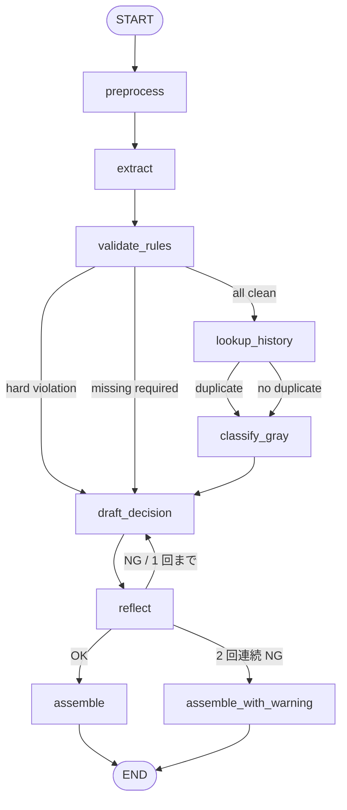

# 設計図: Expense Review Agent v1

> 入力: `v1/spec.md` / 作成日: 2026-05-09 / 作成者: agent-decompose

---

## 1. グラフ構造

LangGraph `StateGraph` でハイブリッドなワークフロー型。`validate_rules` の段階で reject / 軽微 needs_fix を早期分岐させ、グレーゾーンのみ LLM に渡す（コスト最適化）。



> 8 ノード（preprocess / extract / validate_rules / lookup_history / classify_gray / draft_decision / reflect / assemble）。Reflection は最大 1 回ループ。

---

## 2. ノード一覧

| # | ノード | 責務 | LLM/コード | 入力 | 出力 |
|---|---|---|---|---|---|
| 1 | `preprocess` | PII マスキング（氏名・社員 ID）、添付検出 | コード | 楽楽精算 JSON | masked_payload, pii_map |
| 2 | `extract` | OCR テキストから店名・金額・日付・人数等を構造化 | ハイブリッド（Haiku 補完） | masked_payload | parsed_fields |
| 3 | `validate_rules` | YAML ルールでハードチェック（金額上限・必須項目・期限・科目妥当性） | コード | parsed_fields, policy YAML | rule_violations[], rule_trace[] |
| 4 | `lookup_history` | 過去 90 日の同申請者・同店名・同金額の重複検索 | コード（Tool Use） | parsed_fields | duplicate_candidates[] |
| 5 | `classify_gray` | グレーゾーン判定（接待単価超 / 一人出張接待 / 店名と科目の不整合） | LLM (Sonnet) | parsed_fields, violations, duplicates | gray_judgments[], risk_score |
| 6 | `draft_decision` | 4 判定（auto_approve / needs_fix / needs_review / reject）+ 申請者向けフィードバック文言 | LLM (Sonnet / 軽量時 Haiku) | 全 state | decision, reasons, suggested_fixes, feedback_message |
| 7 | `reflect` | 自己レビュー（フィードバックの具体性 / ルール参照漏れ / トーン） | LLM (Sonnet) | draft 一式 | reflect_pass, reflect_issues |
| 8 | `assemble` | rule_trace 統合、unmask、最終出力 JSON 構成 | コード | 全 state | final_output |

ノード数: **8**（spec の規約 5〜7 を 1 つ超えるが、validate_rules + lookup_history を独立させた方が責務が明確）。

---

## 3. 設計パターン選定

### 採用

| パターン | 適用箇所 | 理由 |
|---|---|---|
| **Tool Use** | `lookup_history` ノード | 過去申請 DB 引き当てで重複検出、最小権限ツール 1 種に分離 |
| **Reflection** | `reflect` ノード（最大 1 回ループ）| フィードバック具体性チェック + ルール参照漏れ検査。**致命リスク（不正 auto_approve）を防ぐ第二の検査層** |
| **コード優先のハードチェック** | `validate_rules` ノード | LLM の前段で必ず通す。LLM の OK 判定で覆せない安全装置 |

### 不採用

| パターン | 理由 |
|---|---|
| 純 ReAct | 業務が定型化、LLM の判断余地は害悪 |
| Multi-Agent | v1 では役割分担の利益がコストを上回らない。v2 で「ルール検査エージェント / フィードバック起草エージェント / 監査エージェント」の 3 段化を検討 |
| Planning | 「分類 → 判定 → フィードバック」が固定 |
| RAG（過去事例検索）| ユースケース 22 として B ランク。v2 以降 |

---

## 4. データフロー

### 4-1. State (TypedDict)

```python
from typing import TypedDict, Literal, Optional

class ReviewState(TypedDict, total=False):
    # 入力
    raw_payload: dict        # 楽楽精算 JSON
    application_id: str

    # preprocess の出力
    masked_payload: dict
    pii_map: dict
    has_attachment: bool

    # extract の出力
    parsed_fields: dict      # store_name, amount_jpy, receipt_date, category, counterparty, participants ...
    extract_confidence: float

    # validate_rules の出力
    rule_violations: list    # [{rule_id, severity, message}, ...]
    rule_trace: list         # 監査ログ用、検査したルール全件

    # lookup_history の出力
    duplicate_candidates: list   # 過去 90 日の重複候補
    history_lookup_errors: list

    # classify_gray の出力
    gray_judgments: list     # [{aspect, llm_verdict, confidence, reasoning}, ...]
    risk_score: float        # 0.0〜1.0

    # draft_decision の出力
    decision: Literal["auto_approve", "needs_fix", "needs_review", "reject"]
    reasons: list            # 判定理由の自然言語列
    suggested_fixes: list    # 申請者への具体的修正例
    feedback_message: str    # Slack 配信向け、敬体 100〜300 字
    internal_memo: str       # 経理向け 100 字以内

    # reflect の出力
    reflect_pass: bool
    reflect_issues: list
    reflect_iter: int

    # assemble の出力
    final_output: dict

    # 共通
    cfg: dict
    dry_run: bool
    lite_mode: bool
    used_models: list
    cost_usd: float
```

### 4-2. PII マスキングの流れ

```
raw_payload → preprocess (mask 申請者氏名 / 社員 ID) → masked_payload (LLM への入力)
                                                       ↓
                                                  各ノード（masked のみ扱う）
                                                       ↓
                                              assemble (unmask) → final_output（PII 復元）
```

---

## 5. ツール一覧（詳細は `tools.md`）

| ツール名 | 機能 | 呼び出し条件 |
|---|---|---|
| `lookup_employee(employee_id_masked)` | 社員マスタ参照（所属・等級・承認権限）| 全件 |
| `lookup_policy(category)` | 経費規程の取得（上限金額・必須項目）| 全件 |
| `lookup_past_claims(applicant_id, store_name, amount, days=90)` | 過去 90 日の重複候補検索 | lookup_history ノード |
| `mask_pii(payload)` | PII マスキング（preprocess 内）| 全件 |
| `extract_receipt_fields(ocr_text)` | OCR テキストから構造化抽出補助（Haiku）| extract ノード |

---

## 6. コスト見積もり

### 6-1. 標準モード

| ノード | モデル | 入力 tokens | 出力 tokens | 期待コスト |
|---|---|---|---|---|
| preprocess | - | - | - | $0.000 |
| extract（補完）| Haiku 4.5 | 400 | 100 | $0.0007 |
| validate_rules | - | - | - | $0.000 |
| lookup_history | - | - | - | $0.000 |
| classify_gray | Sonnet 4.6 | 1,000 | 200 | $0.0060 |
| draft_decision | Sonnet 4.6 | 1,200 | 400 | $0.0096 |
| reflect | Sonnet 4.6 | 1,800 | 200 | $0.0084 |
| assemble | - | - | - | $0.000 |
| **合計** | | **4,400** | **900** | **約 $0.025/件** |

→ 目標 $0.03/件以下 ✓（Reflection 1 回ループ含む）

### 6-2. 軽量モード（auto_approve 候補）

| ノード | モデル | 期待コスト |
|---|---|---|
| classify_gray | Haiku 4.5 | $0.0010 |
| draft_decision | Haiku 4.5 | $0.0024 |
| reflect | Haiku 4.5 | $0.0016 |
| **合計** | | **約 $0.0050/件** |

軽量モード起動条件:
- `validate_rules` で違反 0 件 / `lookup_history` で重複 0 件 / リスクスコア低い
- 全件の **約 40〜50% を軽量モード処理** できる想定（規程内の単純申請は多数派）

### 6-3. 月間試算（月 1,500〜2,000 件）

| 内訳 | 件数 | 単価 | 月額 |
|---|---|---|---|
| 標準モード（55%）| 1,000 | $0.025 | $25 |
| 軽量モード（45%）| 800 | $0.005 | $4 |
| **合計** | 1,800 | - | **約 $29/月** |

→ 月予算 $1,000 に対し **3% 程度の消費**。極めて余裕あり（cs_triage より件数少ないため）。

---

## 7. 失敗モードと対処

| ノード | 失敗 | 対処 |
|---|---|---|
| preprocess | マスキング regex 漏れ | 月次 PII 監査で照合 |
| extract | OCR テキスト欠損 | フィールド欠損は validate_rules で「必須項目欠如」として needs_fix |
| validate_rules | YAML 読み込み失敗 | 致命エラー、agent 停止 + Slack alerts |
| lookup_history | DB ダウン | needs_review に倒す（重複検出不能なので人手判断必須）|
| classify_gray | LLM API ダウン | rule-based のみで判定、`flags.ai_classify_failed=True` |
| draft_decision | LLM API タイムアウト | 3 回リトライ → テンプレ定型 + `flags.ai_draft_failed=True` |
| reflect | 2 回連続 NG | 警告フラグ付き assemble、needs_review に格上げ |

---

## 8. 設定駆動範囲（YAML）

```yaml
# config/expense_policy.yaml
policies:
  travel:
    daily_limit_jpy: 30000
    receipt_required_above_jpy: 0     # 全件必要
    counterparty_required: false
  hospitality:
    per_person_limit_jpy: 5000
    receipt_required_above_jpy: 0
    counterparty_required: true
    participants_required: true
  meeting:
    per_person_limit_jpy: 1500
    counterparty_required: false
  consumable:
    pre_approval_above_jpy: 5000

approval_required_above_jpy:
  general: 30000
  travel: 50000
  hospitality: 30000

deadline_days: 60      # 領収書日付からの精算期限
duplicate_lookup_days: 90

models:
  classify_gray: claude-sonnet-4-6
  draft_decision: claude-sonnet-4-6
  draft_decision_lite: claude-haiku-4-5-20251001
  reflect: claude-sonnet-4-6
  extract_assist: claude-haiku-4-5-20251001

reflection:
  max_iterations: 1

cost:
  max_per_request_usd: 0.05
  max_monthly_usd: 1000
```

---

## 9. 主要な設計判断（決めた / 捨てた）

### 決めた

1. **コードでルール検査 → LLM はグレーゾーンのみ**: 致命リスク（不正 auto_approve）を防ぐ二段構え
2. **Reflection は最大 1 回ループ + needs_review 格上げ**: 致命を防ぐが暴走しない
3. **軽量モード起動条件を validate_rules + lookup_history の結果で自動判定**
4. **rule_trace を必ず記録**: 監査要件（佐々木）の絶対条件
5. **YAML 駆動範囲を明確化**: 経理マネージャ（中村）が編集できる粒度

### 捨てた

| 選択肢 | 理由 |
|---|---|
| 純 ReAct（LLM がツールを計画）| 業務定型、誤呼び出しでコスト増 |
| Multi-Agent | v1 では複雑性が上回る、v2 検討 |
| RAG（過去事例検索）| ユースケース 22 で C ランク |
| 領収書画像の直接 OCR | LLM 送信は機密リスク、楽楽精算 OCR を信用 |

---

## 10. 次のアクション

- [ ] `/agent-prototype` で `reference/workflow_skeleton.py` ベースに最小実装
- [ ] DB は YAML / JSON フィクスチャでモック
- [ ] 評価データ 12 件を `eval/dataset/` に作成
- [ ] `config/expense_policy.yaml` の初版

---

## 11. 詳細設計書

シーケンス図・データモデル・エラーフロー・PII 流れは `detailed_design.md` を参照。
