# 詳細設計書: Expense Review Agent v1

> 作成日: 2026-05-09 / 作成者: agent-decompose

---

## 1. システムコンテキスト図

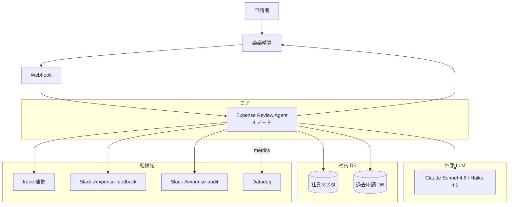

---

## 2. データモデル

### 2-1. State (TypedDict)

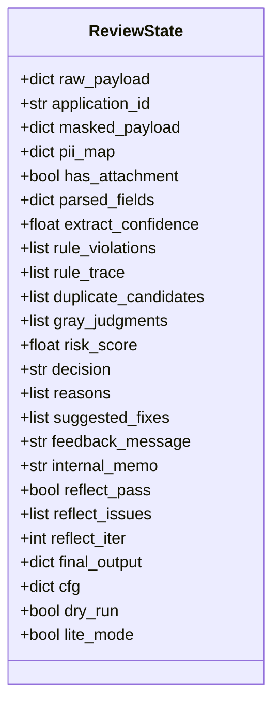

### 2-2. 出力 JSON スキーマ

```json
{
  "application_id": "RKR-2026-05-001234",
  "schema_version": "v1.0",
  "decision": "needs_fix",
  "risk_score": 0.35,
  "needs_human_review": false,
  "reasons": [
    "接待相手先の記入がありません",
    "1 人あたり 6,200 円で接待単価上限 5,000 円を超過しています"
  ],
  "suggested_fixes": [
    "相手先（会社名・役職・氏名）を摘要欄に追記してください",
    "上限超過理由（重要顧客との会食等）を申請理由に追記してください"
  ],
  "feedback_message": "お世話になっております。ご申請いただいた接待交際費 ...",
  "internal_memo": "接待単価超過 + 相手先空欄、申請者へ修正依頼。",
  "rule_trace": [
    {"rule_id": "receipt_required", "result": "pass"},
    {"rule_id": "counterparty_required", "result": "fail", "expected": true, "actual": false},
    {"rule_id": "hospitality_per_person_limit", "result": "fail", "limit": 5000, "actual": 6200}
  ],
  "meta": {
    "category": "hospitality",
    "amount_jpy": 18600,
    "participants_count": 3,
    "store_name": "銀座 寿司 はる",
    "receipt_date": "2026-05-05",
    "applicant_id": "EMP-2024-001",
    "duplicate_count": 0,
    "used_models": ["claude-sonnet-4-6"],
    "cost_usd": 0.0234,
    "lang": "ja"
  },
  "flags": {
    "duplicate_suspected": false,
    "ai_classify_failed": false,
    "ai_draft_failed": false,
    "pii_warning": false,
    "reflect_warning": false
  }
}
```

---

## 3. シーケンス図（主要ユースケース 5 本）

### 3-1. 正常系: auto_approve（出張交通費、規程内）

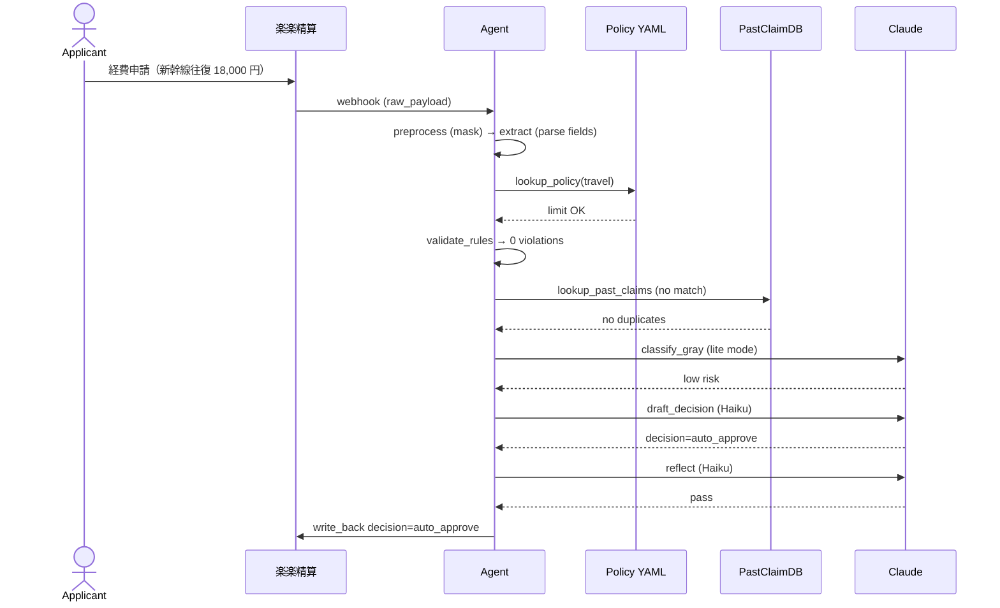

### 3-2. needs_fix: 接待相手先空欄 + 単価超

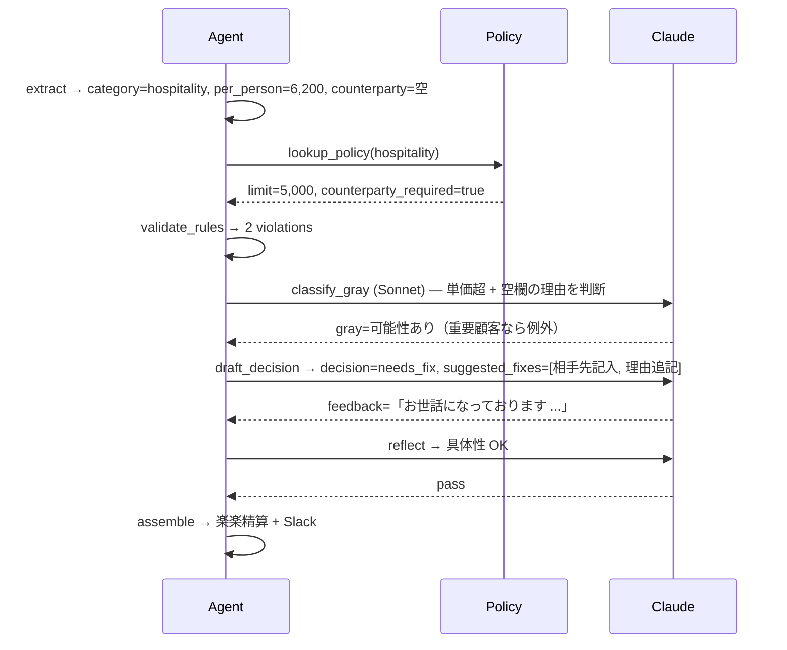

### 3-3. needs_review: 重複疑い

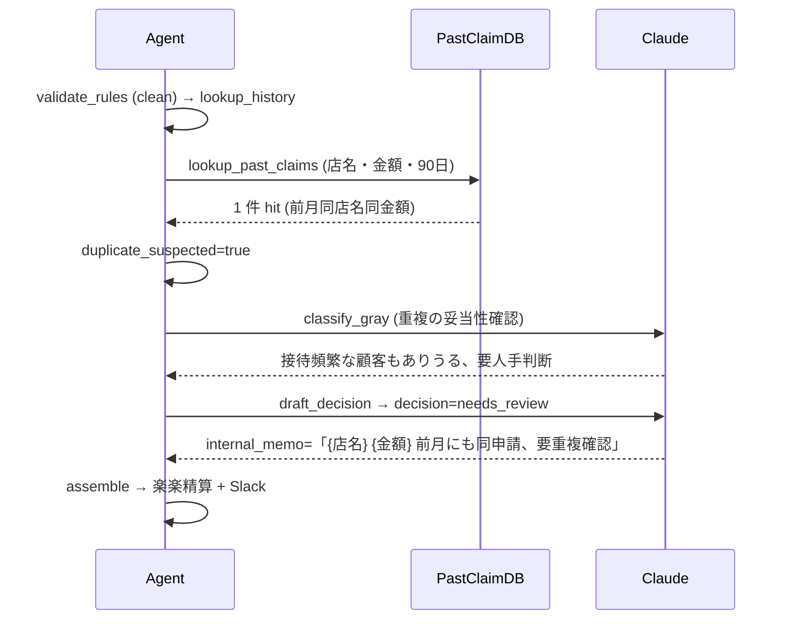

### 3-4. reject: 精算期限切れ

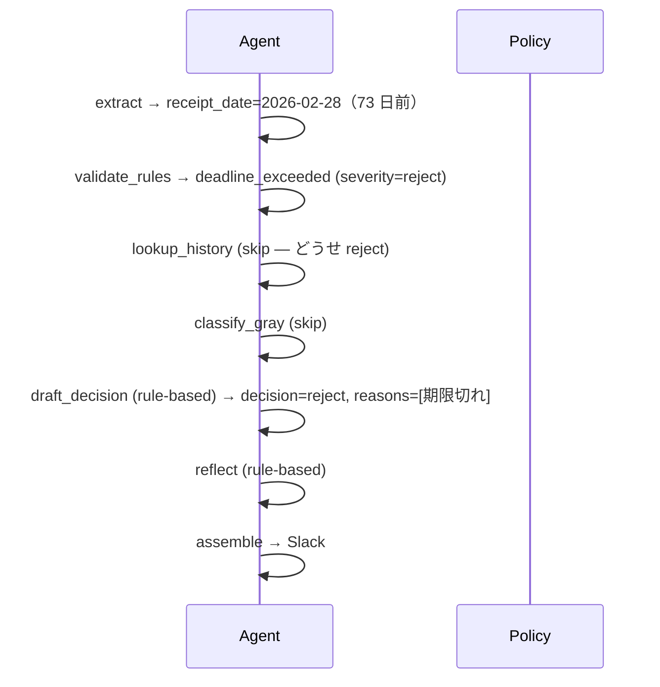

### 3-5. 失敗系: 過去申請 DB ダウン

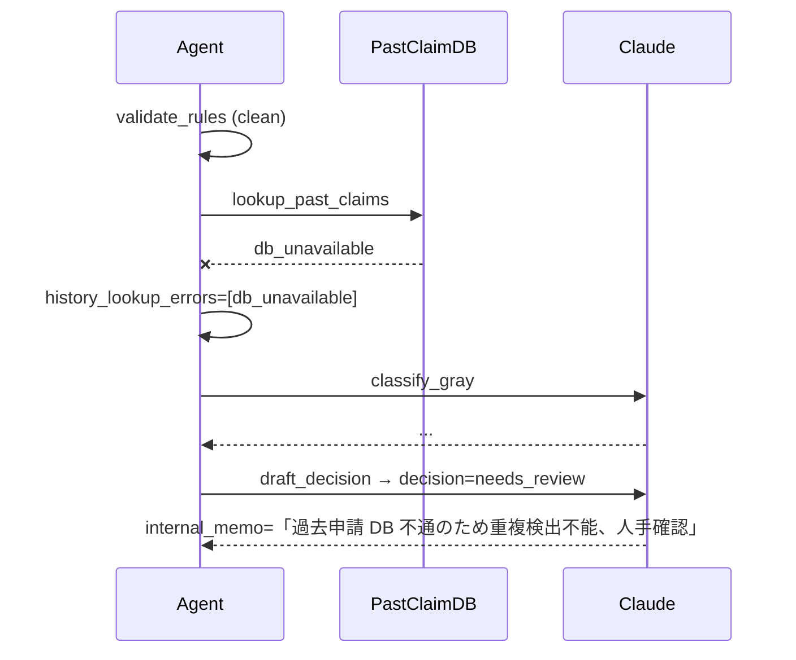

---

## 4. アクティビティ図: 軽量モード起動条件

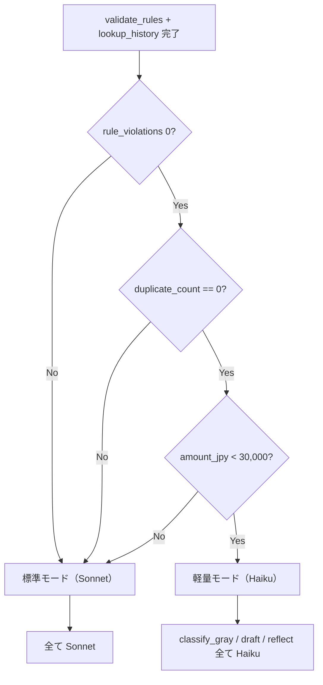

---

## 5. エラー処理・例外フロー

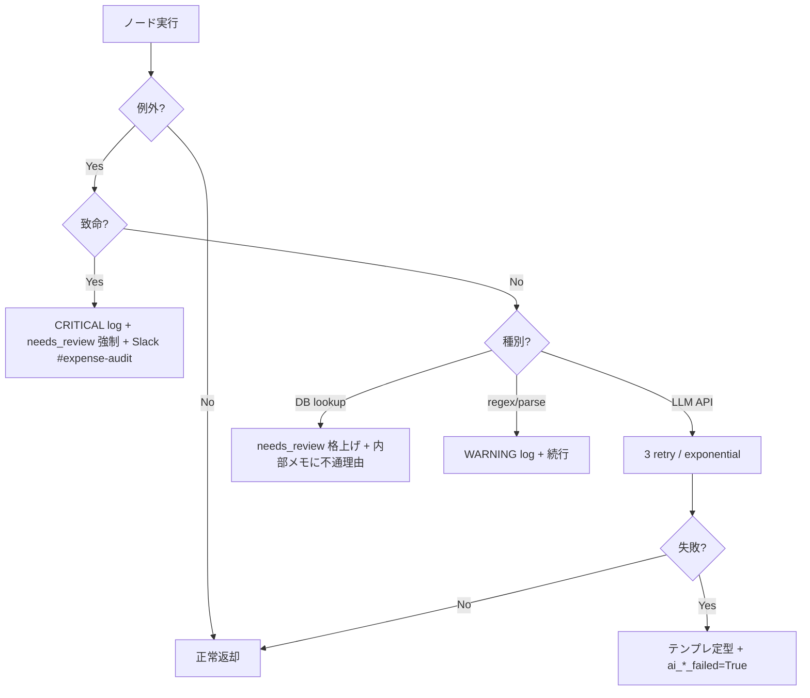

---

## 6. ロギング・監視

### Datadog メトリクス

| メトリクス | 単位 | 用途 |
|---|---|---|
| `expense_review.processed_count` | counter | スループット（decision タグ）|
| `expense_review.latency_seconds` | histogram | P95 レイテンシ目標 15s |
| `expense_review.cost_usd_per_request` | gauge | 1 件コスト目標 $0.03 |
| `expense_review.decision_distribution` | gauge | auto_approve/fix/review/reject の比率 |
| `expense_review.duplicate_detected_count` | counter | 重複疑い検出件数 |
| `expense_review.rule_violation_count` | counter | ルール違反件数（rule_id タグ） |
| `expense_review.lite_mode_rate` | gauge | 軽量モード起動率 |
| `expense_review.reflect_iter_count` | histogram | 平均ループ回数 |
| `expense_review.pii_warning_count` | counter | PII マスキング警告 |
| `expense_review.fallback_template_count` | counter | テンプレフォールバック発火 |

---

## 7. 性能・コスト試算

### 7-1. レイテンシ予算（P95、標準モード）

```mermaid
gantt
    title 1 リクエスト処理時間（P95、標準モード）
    dateFormat X
    axisFormat %S秒
    section ノード
    preprocess (~50ms) :a1, 0, 50
    extract (~150ms) :a2, 50, 200
    validate_rules (~100ms) :a3, 200, 300
    lookup_history (DB ~300ms) :a4, 300, 600
    classify_gray (Sonnet ~3s) :a5, 600, 3600
    draft_decision (Sonnet ~5s) :a6, 3600, 8600
    reflect (Sonnet ~3s) :a7, 8600, 11600
    assemble (~100ms) :a8, 11600, 11700
    write_back (~200ms) :a9, 11700, 11900
```

→ 標準モード合計 **約 12 秒**（P95）。spec §10-2 の **15 秒以内** に収まる。
軽量モード: **約 5〜7 秒**。

---

## 8. セキュリティ要件

### 8-1. データの流れ（PII / 機密情報）

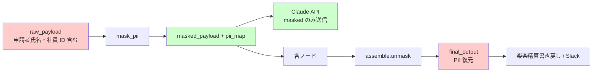

- LLM API には **緑のみ送信**
- 領収書画像本体は LLM に送らない（OCR 抜粋のみ）

### 8-2. アクセス制御

| 項目 | アクセス可 | 認証 |
|---|---|---|
| 社員マスタ | read-only | Okta SSO サービスアカウント |
| 過去申請 DB | read-only | Okta SSO |
| 楽楽精算 API | 申請データ取得 / 判定書き戻し | API キー（Vault） |
| freee API | 連携書き戻し | OAuth |

---

## 9. テスト戦略

### 9-1. 単体テスト対象

| モジュール | テストケース例 | 件数目安 |
|---|---|---|
| `pii_mask.py` | 氏名 / 社員 ID の漏れ・誤マスク | 20 |
| `validate_rules.py` | 各 rule_id の pass / fail | 30+ |
| `lookup_*.py` | 正常 / マスタ未登録 / DB 不通 | 各 3 |
| `extract.py` | OCR 抜粋からの構造化、欠損ケース | 10 |
| `assemble.py` (unmask) | placeholder 全件復元 | 5 |

### 9-2. 評価データセット

- v1 prototype 完了時: 12 件
- v1 eval 完了時: 12 件 + 必要に応じて 5 件追加
- v2 リリース時: 30 件（本番ログから昇格）

---

## 10. 改訂履歴

| バージョン | 日付 | 変更 |
|---|---|---|
| v1.0 | 2026-05-09 | 初版（agent-decompose）|

---

## 付録: cs_triage_agent との比較

| 観点 | cs_triage_agent v1 | expense_review_agent v1 |
|---|---|---|
| ノード数 | 7 | 8（validate_rules を独立）|
| 主要パターン | Tool Use + Reflection | コード優先ハードチェック + Tool Use + Reflection |
| LLM の役割 | 起草 / 分類 / 自己レビュー | グレー判定 / フィードバック起草 / 自己レビュー |
| 致命リスク | クレーム見逃し | **不正 auto_approve** |
| 軽量モード起動 | カテゴリ判定（shipment/cad/billing）| ルール検査結果 + 重複なし + 金額閾値 |
| 月予算消化率 | 36%（$3,000 中 $1,092）| **3%**（$1,000 中 $29）|
